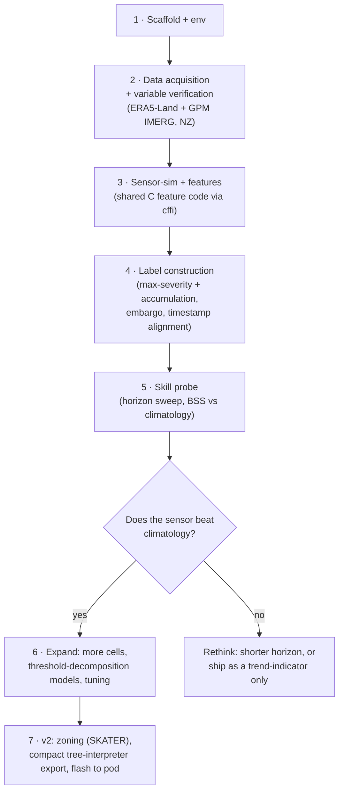
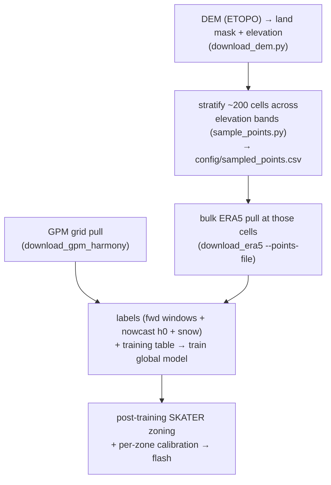

# Pipeline overview

v1 is **point-based** — we prove a single-location model has real skill *before* building the spatial
zoning machinery (SKATER), which is deferred to v2. The skill probe (step 5) is a hard gate: if a point
model can't beat climatology, no amount of zoning or tuning will save it.

## Why this order

- **Riskiest unknown first.** The single biggest risk is *scientific*, not engineering: can one point predict
  rain hours ahead at all? Step 5 answers it cheaply before we invest in zoning, export, or firmware.
- **Data/variable verification (step 2) before features (step 3).** The design assumes certain variables exist
  in ERA5-Land/GPM (e.g. it gives *surface* pressure, not MSLP). We confirm the real catalogues before writing
  feature code against assumptions.
- **Features (step 3) share code with the pod.** Built once in C++, called from Python via cffi, so the model
  trains on the exact bytes the pod will compute — see [02-design-decisions.md](02-design-decisions.md#feature-parity).

## Phase 2 — "train for real" (gridded)

The point probe (steps 1–5) cleared the gate: a single location predicts near-term rain. We're now scaling
from 5 points to the whole country **without** pulling a terabyte, via a **one global model + static
covariates** architecture — full design and diagrams in
[02 · Gridded model](02-design-decisions.md#gridded-model-pre--and-post-training-grid-logic).

**Status (2026-06-04):** DEM + sampler done (`config/sampled_points.csv` = 205 cells); GPM and ERA5 pulls
running in the background on the VM — see
[03 · Acquisition status](03-datasets.md#acquisition-status-2026-06-04). **Next:** the label builder (forward
windows + horizon-0 nowcast + snow), then assemble the training table and train.
