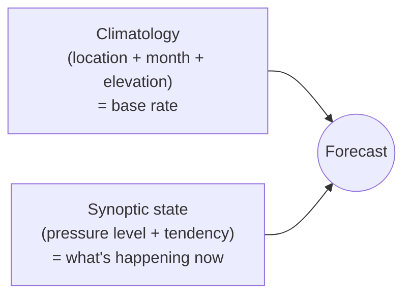
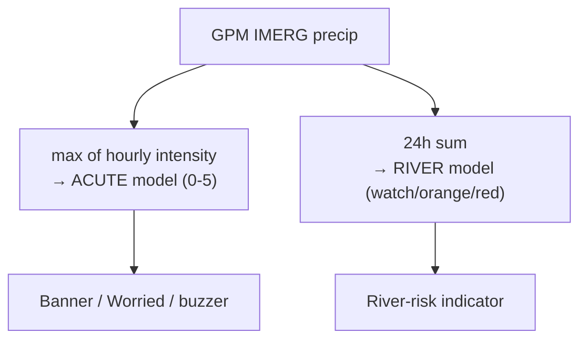
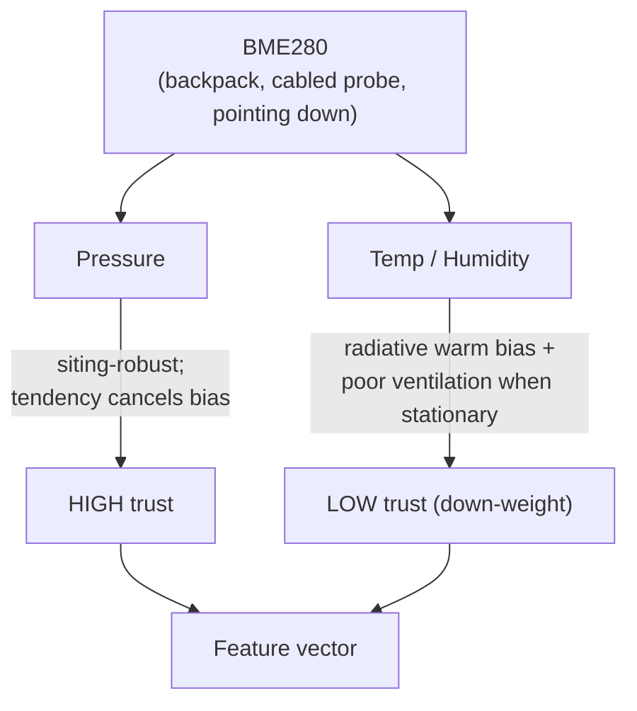
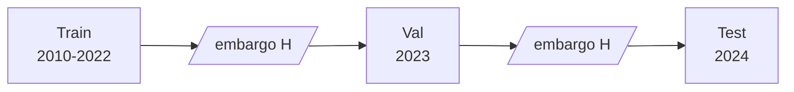
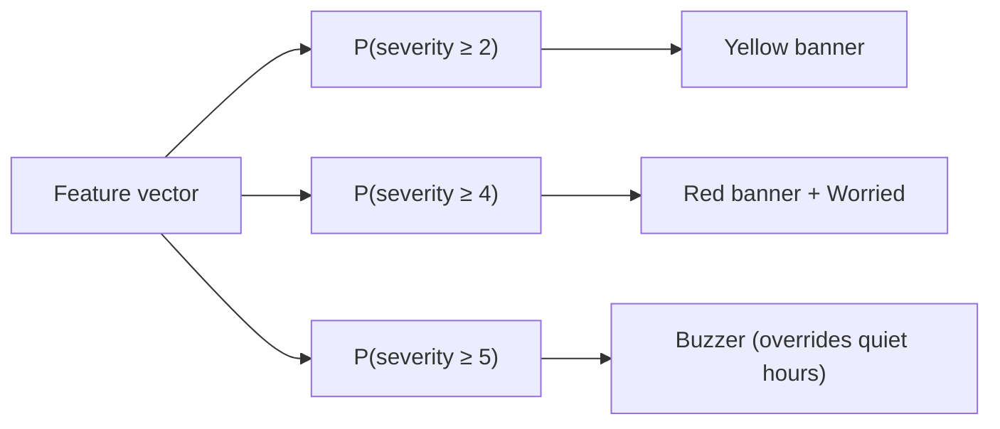
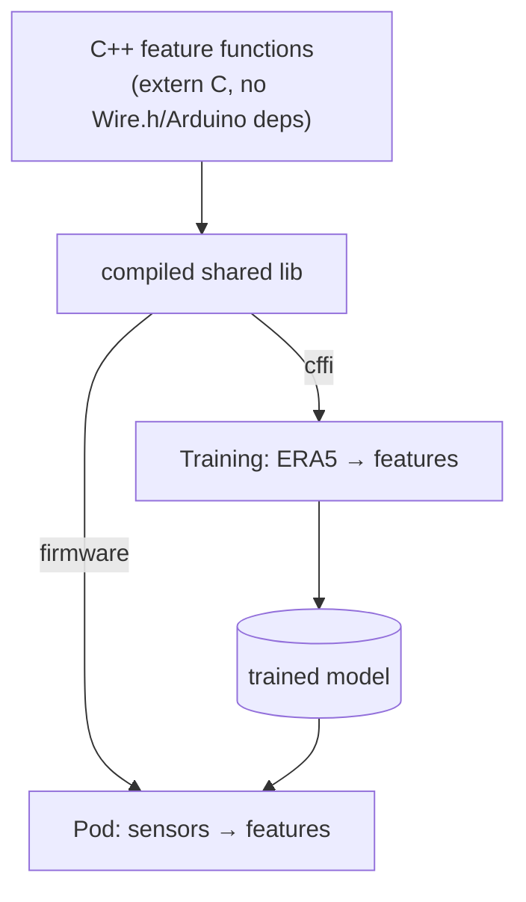
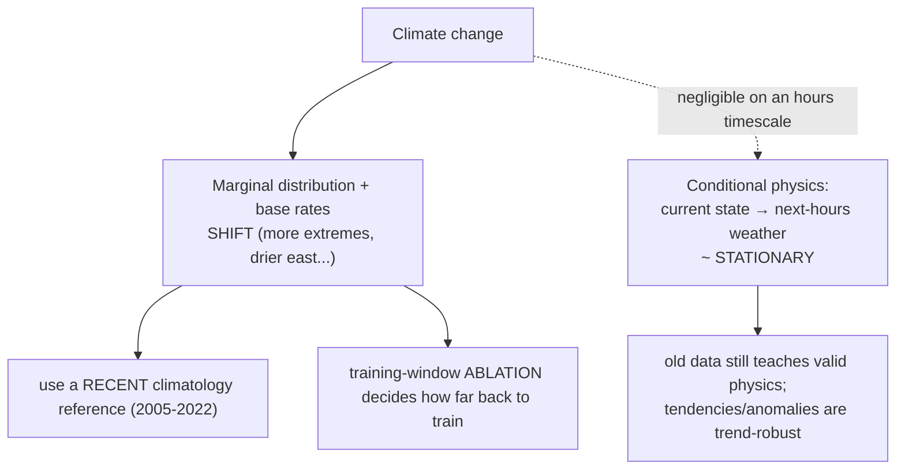

# Design decisions — the *why*, with diagrams

Each section: the choice, the parameter value, and the reasoning. Update the diagram **and** the prose
when a decision changes.

---

## Prediction horizon & the metric (skill over climatology)

**Choice:** sweep prediction **lead** ∈ {6, 12, 24, 48 h}; report **Brier Skill Score vs. climatology**,
never raw accuracy.

Any forecast decomposes into two parts:

A single barometer can't see upstream, but it *can* sense the **synoptic state**, which in NZ persists
~1–3 days (regular westerly fronts). So pressure tendency carries signal out to ~12–36 h — which is also
the actionable window for hiking ("push to the hut today or tomorrow?").

**The trap:** as the horizon grows, the synoptic signal decays toward the climatological mean, so
climatology carries more of the prediction. Evaluated on **raw accuracy**, a useless model scores ~85%
just by echoing "it's usually dry." We therefore measure **skill *over* climatology** — does knowing the
*sensor reading* beat just knowing where and when you are. The climatology baseline uses a fixed
**1991–2020** reference period (pod-knowable, no train/val leakage).

---

## Label = max severity (not total accumulation)

**Choice:** the acute-danger label is the **maximum severity class in [T, T+H]**, not integrated rainfall.

For hiking safety, one violent frontal hour (ridge/exposure danger) matters more than the same total
dribbled over a day. A second, independent model uses **24 h accumulation** for **river/crossing risk** —
sustained soakers that never spike but still make a crossing lethal. Two hazards, two labels:

---

## Sensor trust split (pressure backbone, T/H low-trust)

**Choice:** lean on **pressure tendencies** as the high-trust backbone; **down-weight temp/humidity**.

**Why:** gas pressure equalises regardless of a warm case — it doesn't care about siting. Temp/humidity on a
pack suffer solar/radiative warm bias, *worst* when stationary (no airflow) — which is exactly when inference
is gated to run. Absolute pressure bias (±1 hPa) and GPS-altitude error (~0.12 hPa/m → 1.2–3.6 hPa) both
**cancel in tendencies** (subtraction), so rates beat absolute level. Training augments a **one-sided warm
bias** on temp (contamination only warms) and a per-station pressure offset.

---

## Validation split (contiguous past→future, embargoed)

**Choice:** train 2010–2022 / val 2023 / test 2024, with an **embargo = H** at each boundary. Never random.

**Why not random:** weather is autocorrelated — a randomly-held-out hour sits *between* two training hours,
so the model interpolates (trivial, leaks) instead of extrapolating to an unseen future (the real deployment
task). The **embargo** drops samples whose label window straddles a boundary (adjacent samples share almost
their whole window). When we add cells, the time boundary is **global** across all cells, because neighbouring
cells at the same timestamp are near-duplicate observations of the same weather system.

---

## Class structure — ordinal threshold decomposition {#threshold}

**Choice:** K−1 binary "severity ≥ k" classifiers, **not** a single 6-way softmax. Class count set
empirically (count class-4/5 events first; likely merge extreme → ~5 classes).

**Why:** the pod's banner *is* a set of thresholds, so this maps 1:1. Each binary gets its own
**operating point** — high-severity thresholds biased toward recall (catch storms) but capped to limit
false alarms (**cry-wolf erodes trust**, making the warning useless). Imbalance handled with
`scale_pos_weight` + majority undersampling; **no SMOTE** (it fabricates temporally-incoherent weather).
Metric: **PR-AUC + per-class recall** (ROC-AUC flatters rare-event performance).

---

## Feature parity — one code path {#feature-parity}

**Choice:** the pod's C++ feature functions are the **single source of truth**; training calls them via cffi.

**Why:** if features were implemented twice (Python + C++), any difference — even a different pressure-rate
estimator — means the model trains on one distribution and runs on another, degrading **silently**
(training-serving skew). One shared implementation makes the mismatch *impossible by construction*. A small
**golden-vector** suite guards against future drift. The **sensor-sim layer** (offset, temp-comp, altitude,
cadence, quantization, warm-bias augmentation) sits in front of this and runs even during the skill probe —
otherwise the probe measures the skill of clean reanalysis, not of the pod.

---

## Climate non-stationarity & the training window

**Choice:** acquire the **full 1991–2024** record, decide the training window **empirically** (ablation),
use a **recent** climatology reference (2005–2022, not WMO 1991–2020), and rely on trend-robust features.

NZ has warmed ~0.1 °C/decade (modest mean drift over our span), but heat extremes are ~**4–5× more frequent**
and rainfall geography is shifting (east drying, west/south wetting). So the climate is non-stationary — the
question is whether old data still helps. The key is *what kind of model we have*:

**Why we're robust:** the scary non-stationarity results are about *climate emulators / long-range projection*
that must extrapolate the warming trend itself. We don't — we predict short-range severity *given the current
state*. That conditional mechanism (front + falling pressure → rain in hours) is stationary. Climate change
shifts the **marginals and base rates**, not the hours-ahead physics, so old data is valid (if differently
distributed) — and because **extreme classes are data-starved**, more years likely *helps the rare tail*.

**Where it does bite (and the fixes):**
- *Absolute* temperature is non-stationary (a "warm day" in 1995 ≠ 2024) → we already lean on **tendencies**
  and treat temp/humidity as low-trust; where temperature is used, prefer **anomalies vs. a recent normal**.
- The **climatology reference** matters most: 1991–2020 understates "normal now", so we use a recent
  **2005–2022** window (train-only, no val/test leak). Trend-adjusted normals are a future refinement.
- We **don't assume** — step 5 runs a **training-window ablation** ({2015,2010,2000,1991}→2022, all evaluated
  on 2023/24) to measure where older years stop helping. Val/test stay the *most recent* years, so we always
  evaluate on the current climate (what the pod faces).
