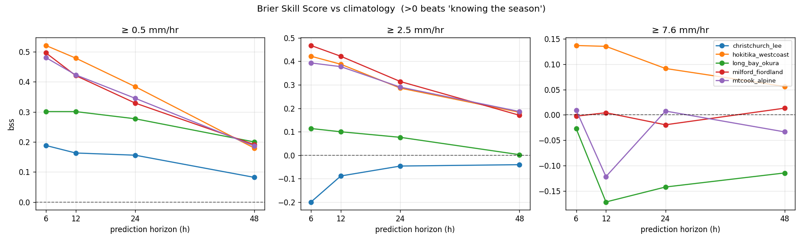
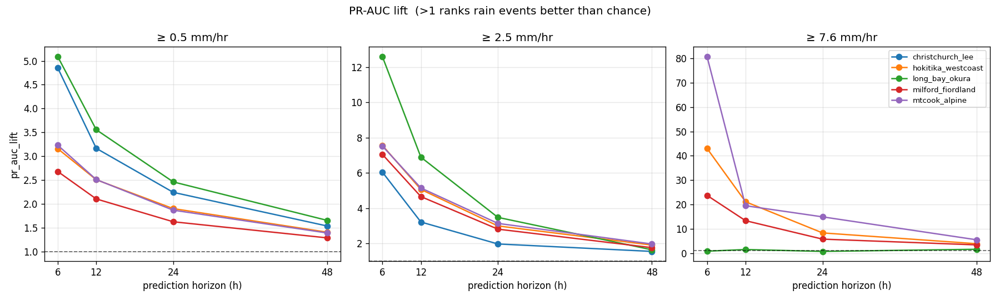
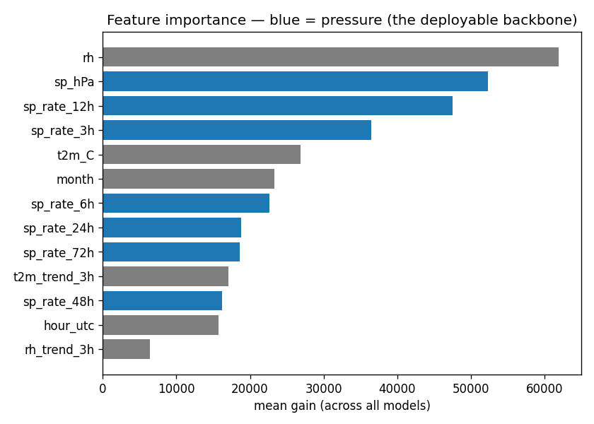
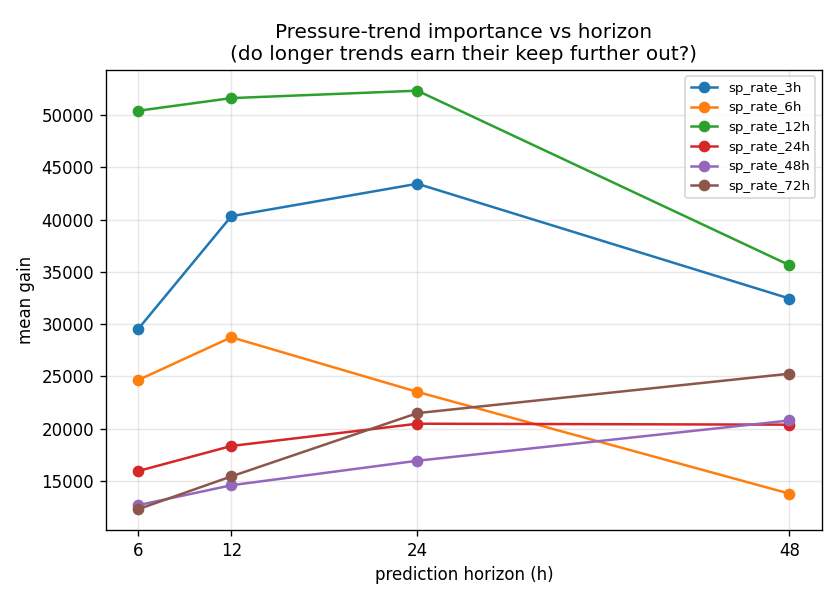
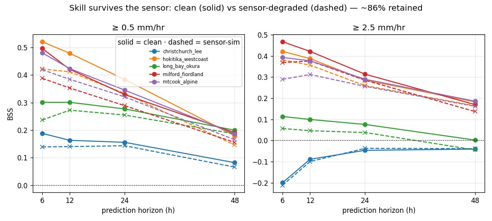

# Results — dress-rehearsal skill probe

> ⚠️ **These are OPTIMISTIC ceiling numbers, not the deployable skill.** The labels are ERA5's own rain
> (circular — features and labels share ERA5 physics → flattering) and the features are *clean* reanalysis
> (no sensor noise/bias yet). Read them as *"is there signal worth chasing, and where?"* — not as the
> accuracy the pod will achieve. The honest number comes after GPM labels + the sensor-sim layer.

**Setup:** 5 NZ points · 13 features (pressure ladder 3/6/12/24/48/72h + humidity/temp + time) · binary
"max rain intensity in next H hours ≥ threshold" · thresholds 0.5 / 2.5 / 7.6 mm/hr · horizons 6/12/24/48h ·
train 2010–2022, **2023 embargo gap**, test 2024 · LightGBM, calibrated (no `scale_pos_weight`).
Regenerate: `python -m podml.probe && python -m podml.plots`.

## Terminology

**Climatology (the baseline).** The "dumb" forecast that ignores today's weather and just predicts the
historical average rate for this place and time of year — e.g. *"in June here, it rains in the next 6h about
30% of the time."* It's the bar any useful model must clear. We compute it from the month-of-year positive
rate in the training years.

**Brier Skill Score (BSS).** How good the model's *probabilities* are, **relative to climatology**. The Brier
score is the average squared error between the predicted probability and what actually happened (0 or 1) —
lower is better. BSS rescales it against the baseline: `BSS = 1 − (model_brier / climatology_brier)`.
**0 = no better than knowing the season · 1 = perfect · negative = worse than climatology.** So BSS > 0 means
the *sensor readings* genuinely add information over the calendar.

**PR-AUC lift.** PR-AUC (area under the precision–recall curve) measures how well the model *ranks* rainy
hours above dry ones, focused on the rare "it rains" events. "Lift" divides it by the base rate, so
**1 = no better than guessing · >1 = ranks events that many times better than chance.** Unlike BSS it ignores
whether the probabilities are *calibrated* (well-scaled) and only cares about ordering — so it's a robust
check that real signal exists even when the probabilities themselves are off.

**Feature importance (gain).** How much each input contributed to the model's decisions. "Gain" sums the
improvement every time the model split on that feature — bigger means the model leaned on it more. It tells us
*what's driving* the predictions (and flags drivers like humidity that may be fragile once real sensor bias
enters).

## 1. Skill — Brier Skill Score vs climatology

`>0` means the sensor state beats *just knowing the season*. Read:
- **"Any rain" (≥0.5) is strongly positive everywhere** — 0.18–0.52 at 6h — and **decays with horizon** to
  0.08–0.20 by 48h. Single-point prediction genuinely works for near-term rain; the sweet spot is **6–24h**.
- **Moderate (≥2.5)** is positive at the wet/alpine points (Hokitika, Milford, Mt Cook ~0.4 at 6h), weak at
  Long Bay, slightly negative at dry **Christchurch**.
- **Heavy (≥7.6)** is marginal/noisy and Christchurch is blank — ERA5 barely has heavy events there. This is
  the clearest sign that **GPM is needed** for the heavy class.

## 2. Ranking signal — PR-AUC lift (calibration-independent)

`>1` means the model ranks rainy hours above dry ones better than chance. Lift is strong at short horizons
across *all* thresholds and fades with lead time — the same story as BSS, but immune to calibration, so it's
the robust confirmation that the discriminative signal is real.

## 3. Feature importance

- **`rh` (humidity) is #1, `sp_hPa` #2** — both powerful here but **low-trust in deployment** (humidity
  suffers backpack siting bias; absolute pressure carries sensor + altitude bias). Expect these to weaken in
  the field — which is exactly why the **pressure *tendencies* are the durable backbone**.
- **`sp_rate_12h` is the top pressure trend** — above 3h and 6h — confirming that a longer window carries
  more information than the short tendencies alone.

## 4. Does longer pressure history earn its keep further out?

**Yes — confirmed.** Importance of each pressure-trend window, split by prediction horizon:
- **`sp_rate_12h` is the best all-round window** (top pressure trend at every horizon).
- **Long trends climb with lead time:** `sp_rate_72h` roughly doubles from 6h→48h (12.3k → 25.3k) and at 48h
  *overtakes* the 6h trend (13.8k); `sp_rate_24h`/`48h` rise similarly.
- **Short trends fade far out:** `sp_rate_6h` collapses 24.7k (6h) → 13.8k (48h).

So the short tendencies capture the *imminent* front (near-term), while the **longer trends carry the slower
synoptic evolution that dominates 24–48h** — the extra pressure memory earns its keep exactly where the
rehearsal showed skill fading. A full week (168h) is worth a quick test for the 48h target.

## 5. Does the skill survive a real sensor? (sensor-sim)

`sensorsim.py` degrades the clean ERA5 signals into what the BME280 would actually feed the model — a
constant pressure offset (~±1 hPa), a one-sided warm temp bias, ±5 % humidity noise, quantization — then we
**train on clean (lab) and evaluate on degraded (deployment)**: the honest sim-to-real gap. Run with
`python -m podml.probe --sensor-sim`.

**~86 % of the BSS is retained** (≥0.5, where clean skill was positive):
- **Graceful degradation, not collapse.** Humidity was the #1 clean feature and took ±5 % noise, yet skill
  fell only ~14 % — the **pressure-tendency backbone** carries enough robust signal to cover it.
- **The loss concentrates at short horizons** (6h drops most; 48h barely moves), because long-horizon skill
  rides the long pressure trends, where the constant offset cancels and per-reading noise averages out.

This is the **pessimistic** case (no training augmentation); augmenting training with random offsets would
retain more. Caveat: the degradation magnitudes are provisional GUESSES — the field-validation loop will
replace them with values measured from the real pod.

## Verdict & what's next

**GREEN, and robust.** Real near-term signal at a single point, and **~86 % survives realistic sensor
degradation** — deployment is viable, not just the lab. The pressure-tendency backbone carries the signal
when the low-trust humidity channel gets noisy. Remaining priorities:

1. **GPM labels** — replace circular ERA5 rain with satellite truth (the honest number; unlocks the heavy
   class). The main remaining data-engineering chunk.
2. **Training augmentation** — train with random sensor offsets so the deployed model is robust by design
   (should push retained skill above 86 %).
3. **Horizon focus** — skill concentrates at 6–24h; that's the honest target band for the banner.
4. **Field-validation loop** (`validate_log.py`) — once deployed, compare logged predictions + sensor
   readings against ERA5/GPM to measure real accuracy *and* calibrate the sensor-sim magnitudes.

Done: ✅ point-skill proven · ✅ longer-trend features (lift the long horizons) · ✅ calibration fixed ·
✅ sensor-sim (skill survives ~86 %).
