# Motion-aware rain-severity model — results review

*Auto-generated by `report_motion.py` from `outputs/motion/`. This document explains both **what the
pipeline does** and **how to read every figure**, then interprets the numbers from this run.*

---

## 0. What you are looking at, in one paragraph

We are trying to answer a hiking-safety question: **given only what a small barometer/thermometer/hygrometer
on a moving hiker can sense, can we predict whether meaningful rain is coming in the next few hours — and how
much better is that than just knowing the local climate?** Everything below is built to answer that honestly
on data the model has **never seen** (the year 2024).

### Key terms (plain definitions)

- **ERA5-Land** — a gridded "reanalysis": a physics model blended with observations that gives an hourly
  best-estimate of weather (pressure, temperature, humidity, rain) for every ~11 km cell of NZ since 1950.
  We use it as the **input** the pod would sense, and to build realistic histories.
- **GPM IMERG** — satellite-measured rainfall, independent of ERA5's physics. We use it as the **truth**
  (the label) so the skill number is honest and not circular.
- **Cell** — one ~0.1° (~11 km) grid square. The model works per cell.
- **Horizon (H)** — how far ahead we predict: 0 (now), 6, 12, 24, 48 hours.
- **Threshold** — how hard it must rain to count as a "yes": ≥0.5 (any rain), ≥2.5 (moderate), ≥7.6 mm/hr
  (heavy). We train a separate yes/no model for each threshold × horizon — 15 in all.
- **MSLP** (mean sea-level pressure) — pressure corrected to sea level so readings at different altitudes
  are comparable. Essential for a *moving* hiker who changes elevation (see §1).
- **BSS** (Brier Skill Score) — our headline metric. The Brier score is the average squared error of a
  probability forecast (0 = perfect). BSS rescales it against a baseline: **BSS = 1 − (model error ÷
  baseline error)**. So **BSS = 0** means "no better than the baseline", **1** means perfect, and
  **negative** means *worse* than the baseline. Our baseline is **cell+month climatology** — the historical
  rain frequency for *this cell in this calendar month*. In words: *does the barometer beat simply knowing
  where you are and what month it is?* That is a deliberately tough, honest bar.

---

## 1. The logical process (and the "why" at each step)

```
GPM IMERG rain  ──►  per-cell label: did it rain ≥threshold in the next H hours?
ERA5-Land grid  ──►  simulated hiker PATH across cells (Markov still/walk/drive)
                          │  pressure reduced to MSLP with ERA5's own orography
                          │  + GPS-altitude error (the only residual motion noise)
                          ▼
                     sensor-sim (BME-style bias/noise)  ──►  pod-replicable feature vector
                          │  + static context: elevation, climate zone, local climatology
                          ▼
           one LightGBM classifier per (threshold × horizon)
                          ▼
           evaluate on held-out 2024: skill, per-cell, per-motion, errors
```

**Why a moving path, not a fixed point?** Every real pod reading is GPS-stamped, so the pod's memory is a
*trajectory* through cells, not a single station. If a hiker climbs from a valley to a saddle, raw pressure
falls ~90 hPa from *altitude alone* — which a naive model reads as a violent storm. We defuse this by
reducing pressure to **MSLP using ERA5's own orography**, so only weather moves the number; the leftover
error is just GPS-altitude noise, which **cancels in pressure *trends*** (the high-trust features). Training
on simulated motion means the model meets this noise in the lab instead of being ambushed in the field.

**Why a per-(threshold × horizon) set of yes/no models?** The pod's banner *is* a set of thresholds
(yellow/red), so one classifier per threshold maps straight onto the device, and each can have its own
operating point (see §6).

---

## 2. The playing field (static maps)

Before any model, these describe the terrain and climate the model must cope with. They also validated the
data plumbing (grid alignment, the MSLP fix).

**Terrain + the model grid** — left: real elevation; right: the blocky 0.1° cells the model actually uses,
with the training cells marked.

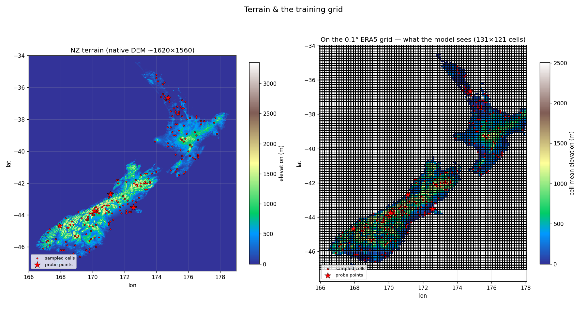

**Static per-cell variables** — elevation, climate zone, and which cells are valid land (ERA5-Land masks the
sea).

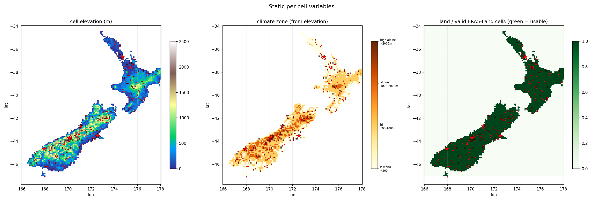

**Climatology (2016–2024 averages)** — mean rain, temperature, and MSLP. Read it as a sanity check: the
**West Coast / Southern Alps are soaked, Canterbury's lee is dry, the North Island is warm** — textbook NZ.
The MSLP panel is near-uniform (~1015 hPa) as it should be; the faint alpine texture is the known difficulty
of reducing pressure to sea level under tall mountains and is harmless (it is a static offset that cancels in
trends).

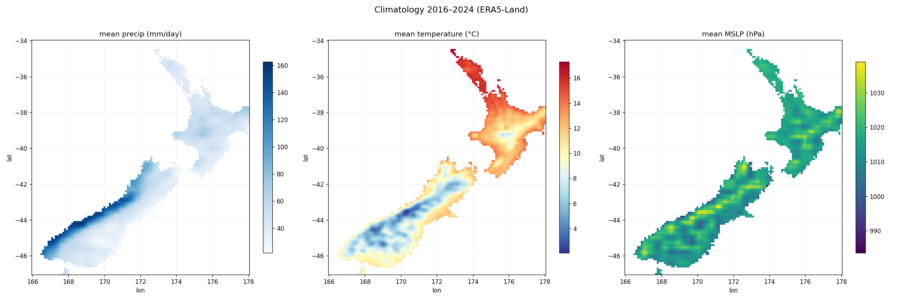

---

## 3. Headline skill — does the barometer beat climatology?

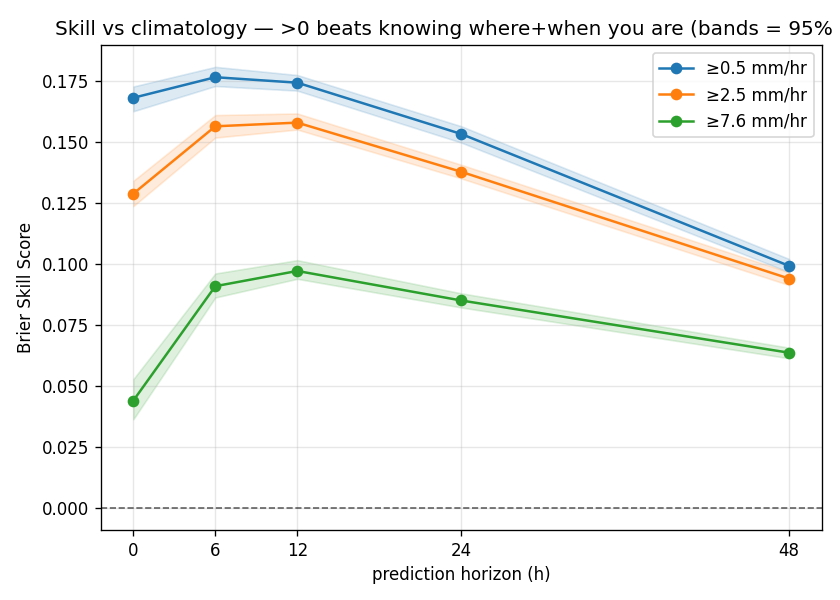

**How to read it:** each line is a rain threshold; the y-axis is BSS (skill over climatology). **Above the
dashed zero line = the sensor adds real information** beyond knowing where/when you are.

**Result:** every one of the 15 models is **positive** — the barometer beats climatology everywhere. Best
single result: **BSS 0.177** at ≥0.5 mm/hr, +6 h. Peak skill
per horizon: +0 h → 0.168 (≥0.5 mm/hr); +6 h → 0.177 (≥0.5 mm/hr); +12 h → 0.174 (≥0.5 mm/hr); +24 h → 0.153 (≥0.5 mm/hr); +48 h → 0.099 (≥0.5 mm/hr). Skill is strongest at **6–12 h** and **fades by 48 h** — exactly the physics we
expect: a barometer senses the *current* weather system, which in NZ persists ~1–3 days, so its edge decays
as the forecast reaches past that system into climatological averages.

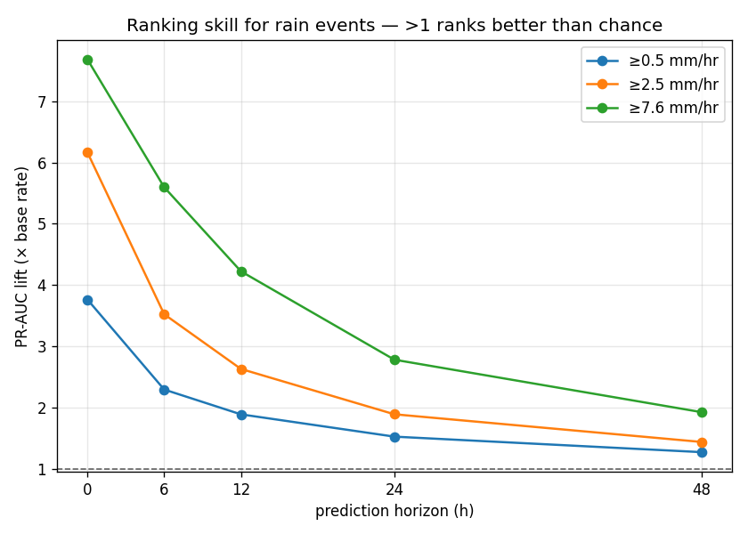

**PR-AUC lift** measures *ranking* skill: of all hours, does the model push the rainy ones to the top?
"Lift" is relative to the base rate, so **>1 means better than random ranking**. It stays well above 1 and is
*highest for the rare heavy-rain class* — the model is best at the events that matter most for safety, even
though those have the lowest BSS (rare events are intrinsically hard to score).

Full numbers (note `pos_rate` — the base rate — climbs with horizon: a longer window is more likely to catch
*some* rain; ≥0.5 mm/hr goes +0 h ≈ 8%, +6 h ≈ 20%, +12 h ≈ 29%, +24 h ≈ 43%, +48 h ≈ 61%):

| threshold | horizon | bss | ci_lo | ci_hi | pr_auc_lift | pos_rate | n_test |
| --- | --- | --- | --- | --- | --- | --- | --- |
| 0.500 | 0 | 0.168 | 0.163 | 0.173 | 4.235 | 0.082 | 204827 |
| 0.500 | 6 | 0.177 | 0.173 | 0.181 | 2.441 | 0.198 | 204827 |
| 0.500 | 12 | 0.174 | 0.171 | 0.178 | 1.955 | 0.293 | 204827 |
| 0.500 | 24 | 0.153 | 0.150 | 0.157 | 1.569 | 0.431 | 204827 |
| 0.500 | 48 | 0.099 | 0.097 | 0.102 | 1.282 | 0.615 | 204827 |
| 2.500 | 0 | 0.129 | 0.124 | 0.134 | 7.321 | 0.031 | 204827 |
| 2.500 | 6 | 0.157 | 0.152 | 0.161 | 3.793 | 0.089 | 204827 |
| 2.500 | 12 | 0.158 | 0.155 | 0.162 | 2.781 | 0.142 | 204827 |
| 2.500 | 24 | 0.138 | 0.135 | 0.141 | 1.988 | 0.234 | 204827 |
| 2.500 | 48 | 0.094 | 0.091 | 0.097 | 1.479 | 0.381 | 204827 |
| 7.600 | 0 | 0.044 | 0.036 | 0.053 | 12.603 | 0.007 | 204827 |
| 7.600 | 6 | 0.091 | 0.086 | 0.096 | 6.907 | 0.024 | 204827 |
| 7.600 | 12 | 0.097 | 0.094 | 0.102 | 4.720 | 0.043 | 204827 |
| 7.600 | 24 | 0.085 | 0.082 | 0.088 | 3.033 | 0.079 | 204827 |
| 7.600 | 48 | 0.064 | 0.061 | 0.066 | 2.081 | 0.144 | 204827 |

---

## A–D scorecard — what worked, what didn't

*Every option was **measured** off the cache (bootstrap CIs), not assumed. The headline finding: the baseline — motion-sim + the pressure backbone + light static context — is already strong and well-calibrated, so several standard add-ons turned out **neutral or harmful**. Honest negative results that *raise* confidence in the core.*

| item | verdict | measured evidence |
|---|---|---|
| A1 snow / A2 accumulation | ⏸ deferred | (snow derivable from GPM `probLiquid`; river out of scope) |
| B1 drop `zone` | ✓ done, no cost | importance ≈ 0 |
| B2 GPM precip-climatology | ✗ **hurts**, dropped | −0.006 BSS (it ≈ the climatology baseline) |
| B3 lat/lon | ✓ kept (niche) | +0.003 at heavy vs +0.001 common |
| B4 ruggedness ✓ / coast-dist ✗ | rugged kept, coast dropped | rugged +0.002 heavy; coast ≈ +0.000 |
| B5 cyclic month | ~ kept (free, tiny) | ~+0.001 |
| C2 post-calibration | ✗ doesn't help, skip | worst Δ=-0.022 (≥7.6/+6h); model already calibrated |
| C3 scale_pos_weight | ✗ no ranking gain, skip | ROC-AUC spread 0.000 across weightings; recall@FAR.1 = 0.52 (+6h) |
| C1 split 2015-22/23/24 | ✓ done | — |
| D2 learning curve | ✓ **answered** | common plateaus ~200 cells; heavy climbs 0.042→0.071 to ~1600 |

---

## 4. Which grids are predictable? — the SKILL ATLAS

Dense per-cell BSS over all **2,861 land cells**, the full threshold × horizon grid. **Blue = the barometer
beats climatology at that cell; red = it doesn't.** Of 2861 scored cells (≥0.5 mm/hr, +24 h),
**95% are positive** (mean BSS 0.152) — broadly skilful nationwide, so the model generalises
across regions rather than memorising a few wet spots.

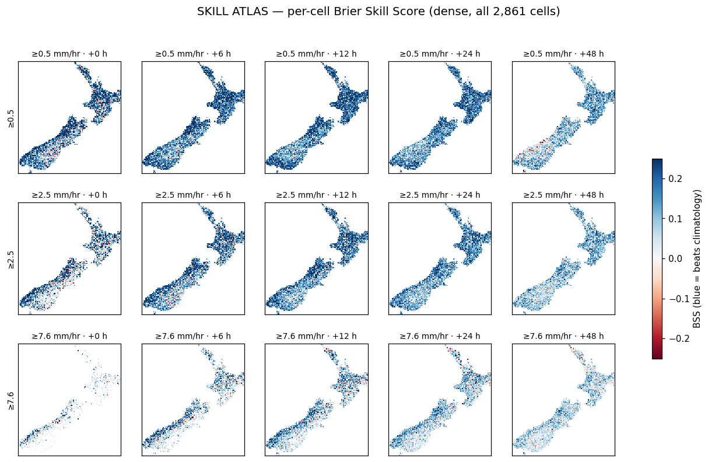

**Diagnostic — sample size per cell** (which grades are solid vs wobbly; heavy-rain cells see few events all
year, so their maps are noisier):

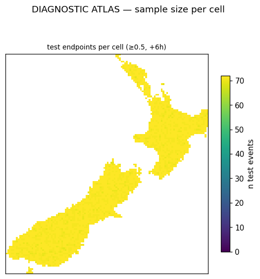

---

## 5. Does moving cost skill? (the central bet) — the MOTION ATLAS

Split by the hiker's **recent motion** (last 6 h). If motion wrecked the pressure history, "drive" would
collapse. **It barely moves:** mean BSS (≥0.5 mm/hr, +6 h) — **drive** 0.145, **still** 0.180, **walk** 0.190, a spread of only
**~0.046 BSS**. The **MSLP reduction + GPS-error model keep the pod about as skilful moving as
still**, so we don't refuse predictions on the move. The map shows *where* movement costs most (expected:
steep terrain, via altitude noise):

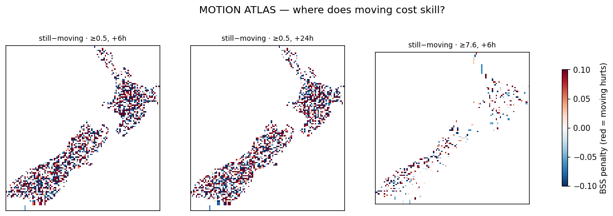

---

## 6. Error analysis — the ERROR & SEASONAL ATLASES

**Where it makes which kind of mistake** — false-alarm rate (cries wolf) vs miss rate (lets storms through),
per cell, at the 10%-false-alarm banner point:

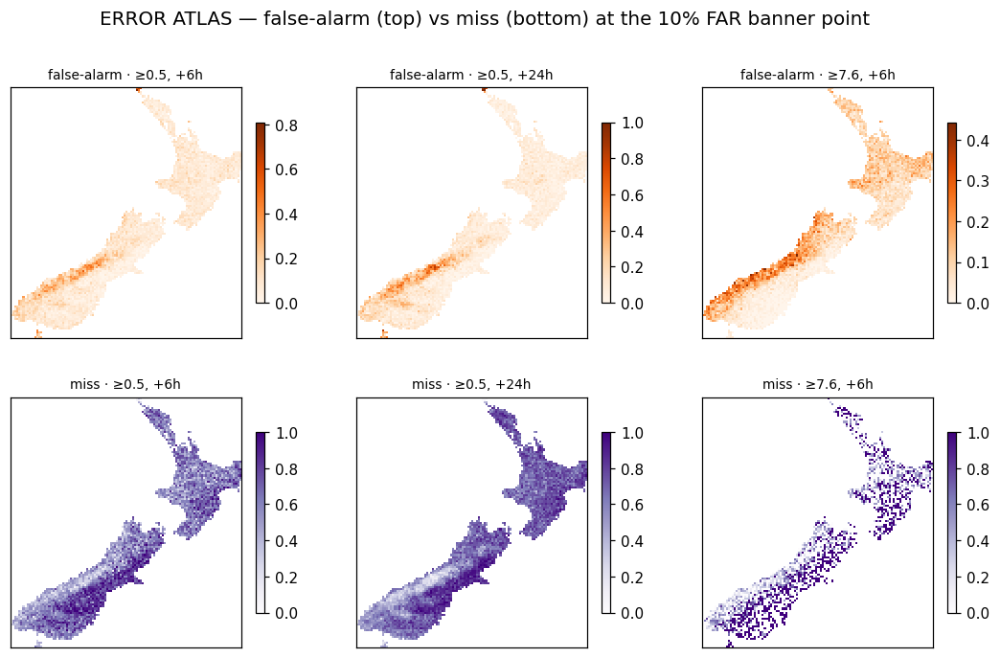

**Seasonal skill** — NZ's regimes are strongly seasonal, so predictability shifts through the year:

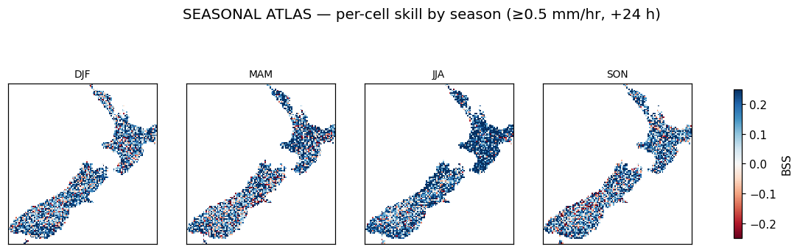

The actionable banner spec from the operating-point analysis (C3): at a 10% false-alarm budget the model
**catches ~52% of heavy-rain (≥7.6 mm/hr) events 6 h ahead** (ROC-AUC 0.836). Designing the banner = picking a
point on that curve — high-severity alerts lean toward recall but capped to limit false alarms, because
**crying wolf erodes trust.**

---

## 7. How many cells is enough? — the LEARNING CURVE

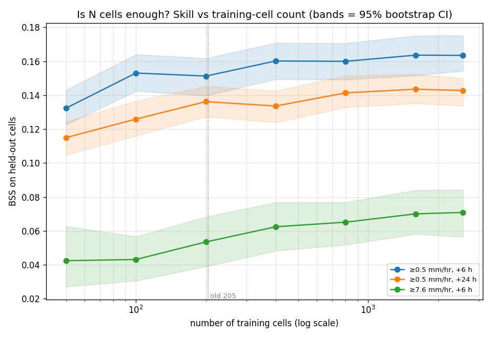

Trained on growing cell-subsets, evaluated on **held-out cells** (spatial generalisation), with bootstrap CIs.
**Common/moderate rain plateaus by ~200 cells** — the old 205-cell set was already enough. But **heavy rain
keeps climbing to ~1,600 cells** (the rare tail is data-starved, so every extra cell adds heavy-rain
examples). So the final model trains on all cells to bank the heavy-rain skill — at no cost (one shared model,
no memorising).

---

## 8. What the model leans on

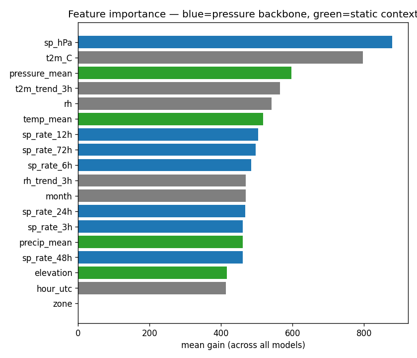

The strongest single feature is **absolute MSLP (`sp_hPa`)**, with temperature close behind; the top five by
gain are `sp_hPa`, `t2m_C`, `pressure_mean`, `lat`, `hour_utc`. Collectively the **pressure family — absolute MSLP plus the tendency ladder
(3 h, 6 h, 12 h, 24 h, 48 h, 72 h) — dominates**, exactly the high-trust backbone we designed for. Static context (elevation,
lat/lon, ruggedness) adds the "wet vs dry place" geography — and the **feature ablation (B3/B4) showed lat/lon
and ruggedness pay off 2–3× more for the rare heavy class than overall**, so we keep them even though they
look marginal on average.

---

## 9. Caveats & honest limitations

- **Label resolution:** GPM truth is one number per ~11 km cell — sub-cell rain variation is *not in the
  truth* and cannot be scored.
- **The strong baseline is the headline finding:** three standard add-ons (GPM precip-climatology,
  post-calibration, class-weighting) were **measured to be neutral-or-harmful** — the motion-sim + pressure
  backbone is already strong and well-calibrated. Honest negatives that raise confidence in the core.
- **Snow & river hazards are stubbed** (snow is derivable from GPM `probabilityLiquidPrecipitation` when we
  want it; river is out of scope).

## 10. Next steps

1. **Method-evaluation suite (rebuilds):** motion-vs-stationary, MSLP-vs-raw, sensor clean-vs-degraded — do
   the *core* design choices earn their place (small-cell rebuilds).
2. **D4 sensor-precision sensitivity** — sweep GPS-altitude / sensor noise to guide hardware.
3. **SHAP** for per-prediction, conditional feature attribution beyond the group ablation.
