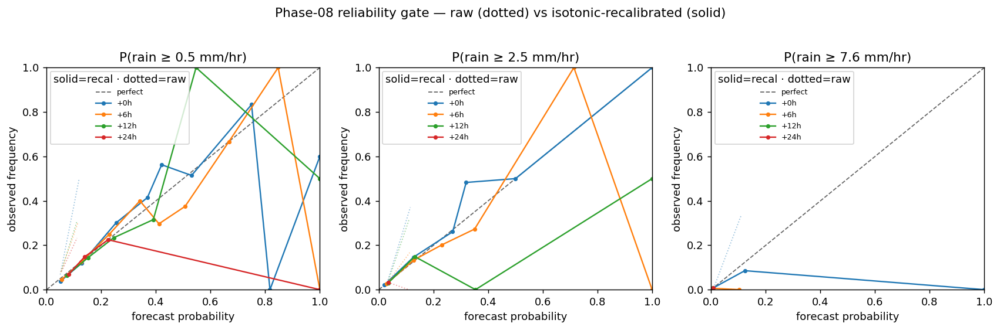
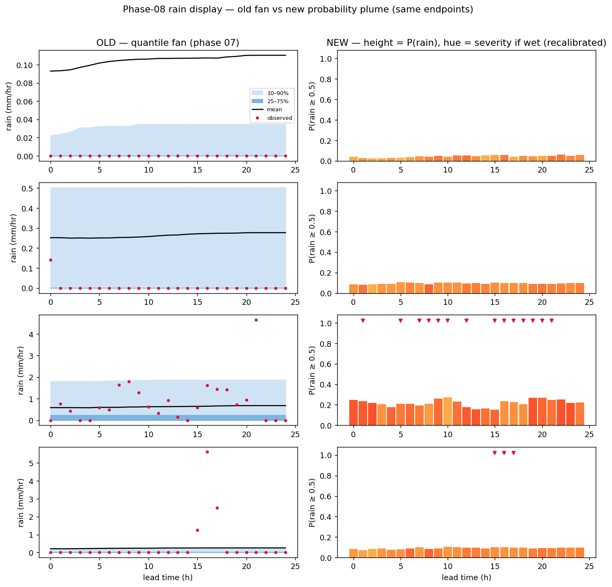
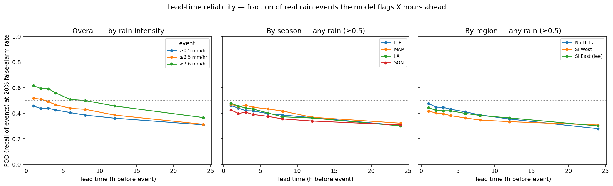
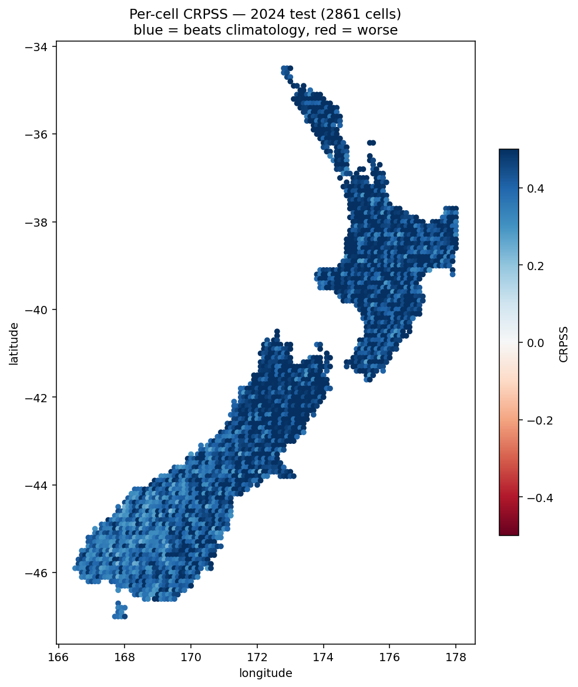
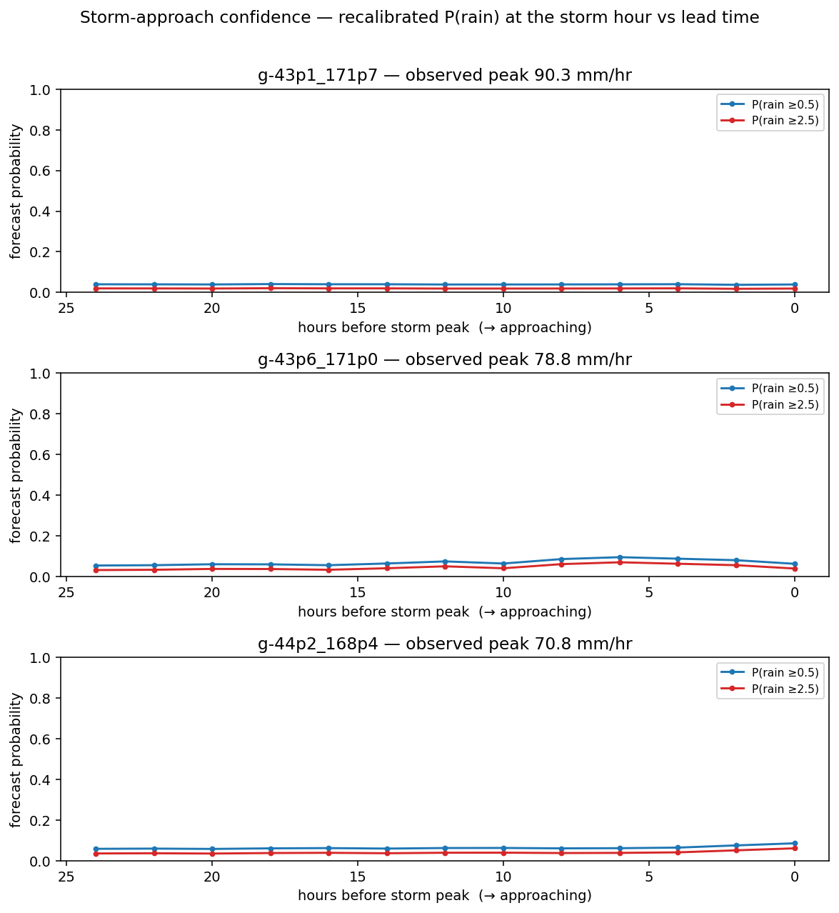

# 08 — Rain display: from the quantile fan to an exceedance-probability plume

> **Living doc for the current design phase.** Carries the settled conclusions of phase 07
> ([07-forecast-ensemble.md](07-forecast-ensemble.md)): input/feature skill is at the **single-point
> physical ceiling** — the v3 ablation cut *all six* engineered features (ΔCRPSS ≈ 0, CIs spanning zero),
> and CRPSS ≈ 0.43–0.49 is labelled "near the physical ceiling for single-point surface observations."
>
> **The lever therefore moves from the *inputs* to the *deliverable*.** This phase does **not** chase new
> signal (none is available — see 06/07 and the nowcast-direction investigation). It fixes **how we present
> the distribution we already have**, because the current rain *visualisation* is broken in a way that is
> structural, not a tuning problem.
>
> **Status: proposed.** No model change is assumed for the headline; the whole thing is post-processing of
> outputs the current run already produces, **gated on one reliability check** (§6). Every claim about the
> current model is grounded in `train_ensemble.py` as of 2026-06-11.
>
> **Investigation stance (this phase): cheap-first and non-destructive.**
> - **No retrain, no cache rebuild, no new heads** in the first pass. Use the model already training; read off
>   what it emits.
> - **Read-only on existing artifacts.** Do **not** overwrite `outputs/ensemble/*` or
>   `docs/figures/ensemble/*`. New figures/CSVs from this investigation go to a **separate path**
>   (`outputs/ensemble/display_check/` and `docs/figures/display/`), so phase-07 results stay intact.
> - **`train_ensemble.py` is not edited** in the first pass — the reliability check and the plume mock are a
>   small standalone script that *loads* the saved boosters. Any model change (dedicated head, recalibration)
>   is deferred to *after* the cheap check says it's needed (§6 escalation ladder).
> - **Manual / opt-in only.** The script is run by hand when chosen — it is **not** wired into the trainer, has
>   no hook, and never fires automatically.
> - **The old rain fan stays.** This phase is *additive*: the check renders the **existing quantile fan and the
>   new height+hue plume side-by-side** on the same endpoints, so the phase-07 way of doing things stays fully
>   viewable for comparison. Nothing about the fan is removed until a deliberate later decision (§9).

---

## 1. The problem, stated precisely

The phase-07 rain plume draws a **quantile fan**: a centre line with prediction-interval bands (10–90% outer,
25–75% inner) on a **rain-amount (mm/hr)** y-axis. In practice the bands are **either pinned flat on zero or
ballooned far too wide** — never usefully in between. This is not a parameter we have failed to tune. It is a
structural consequence of what rain *is*, and no band width fixes it.

**Acronyms used below.** *CDF* = cumulative distribution function, `F(x) = P(rain ≤ x)`. *PoP* = probability
of precipitation. *BSS* = Brier Skill Score (probability skill vs climatology; 0 = no better, 1 = perfect).
*CRPS(S)* = Continuous Ranked Probability Score (Skill) — the proper score for a full predictive
distribution. *CQR* = Conformalized Quantile Regression (a finite-sample interval recalibration).
*BCE* = binary cross-entropy.

## 2. Why the fan cannot work for rain (and why it is *correct* for temperature)

Rain at a point is **zero-inflated**: a probability *atom at 0* (≈ 86% of hours are dry) plus a continuous
*wet tail*. A quantile fan **inverts the CDF** — it asks "what rain amount sits at the 10th / 90th
percentile?" Invert a distribution that is 86% zero and there are only two outcomes:

- **Quantiles on the full distribution** → the 10th/25th/75th percentiles all fall *inside the zero atom* →
  the bands collapse onto the 0-line. *("Tight around zero.")*
- **Quantiles on the wet-only distribution** → they span the wet tail but are nonsense on the 86% of hours
  that are dry → the bands balloon. *("Too wide.")*

There is no width in between, because one continuous band is being asked to straddle a point mass *and* a
tail. The phase-07 two-head gating was a patch on the wrong **representation**.

**This is not just collapse — the wet-conditional intervals are also over-confident.** From 07 §10, after the
wet-conditional fix, observed coverage on **wet hours** was:

| Band | h=0 | h=24 | Target |
|---|---|---|---|
| 10–90 (raw, wet) | 31% | 13% | 80% |
| 25–75 (raw, wet) | 3% | 0% | 50% |

The truth lands inside the nominal 80% band only ~31% of the time. So the **interval outputs are not
display-grade** regardless of which framing we pick — a second, independent reason to stop drawing amount
bands for rain. (CQR offsets are applied on wet validation hours; re-check post-CQR coverage in §6, but do not
assume it reaches target.)

**The fan was designed for a symmetric, continuous variable.** That is *correct for temperature* — keep the
two-sided fan there. It is *wrong for zero-inflated rain*. The deliverable must be **variable-specific**.

## 3. The reframe: plot probability, not amount

Flip the axis of presentation. Instead of inverting the CDF (amount given a probability), **evaluate** it at
fixed, meaningful thresholds (probability given an amount):

```
P(rain ≥ 0.5)   P(rain ≥ 2.5)   P(rain ≥ 7.6)   mm/hr
```

A probability is **always well-defined and bounded 0–100%**, so "too wide / pinned at zero" *cannot occur*.
Zero-inflation becomes honest empty space, not a broken band. The displayed CDF is the **blended**
distribution (`F_shown = w·F_model + (1−w)·F_clim`, already computed), so a low-skill cell's display retreats
to climatology exactly as its banner number does.

## 4. The encoding: height + hue (not a stack)

A naive "stack to 100%" bar (dry / light / moderate / heavy) **fails on readability**: the dry segment
dominates almost every hour, and the bins that matter most (moderate / heavy) are the *rarest*, so they render
as invisible slivers even when they are the point. Instead, put the two orthogonal questions on **two visual
channels**:

- **Bar height = P(rain ≥ 0.5 mm/hr)** — *"will it rain"*. Short on dry hours, tall when rain is likely; uses
  the full axis when it matters.
- **Bar hue = severity *if* it rains** — *"how bad"* — yellow → orange → red.

```
P(rain)
100│                      ▓▓  ██
   │                  ▒▒  ▓▓  ██
 50│              ▒▒  ▒▒  ▓▓  ██
   │   ░░     ░░  ▒▒  ▒▒  ▓▓  ▓▓
  0└───░░──────░░──▒▒──▒▒──▓▓──██────
     +3   +6  +9 +12 +15 +18 +21h
   hue if it rains:  ░ light   ▒ moderate   ▓/█ heavy
```

Now **nothing important is ever a sliver**: likelihood is length, severity is hue, and they never compete for
the same pixels. A 4%-chance-of-heavy hour reads as a *short red nub* — small but visible — not a 4% slice
buried in a 100% stack.

**Worked example (read one column).** At +12 h the bar is ~70% tall and orange: *"≈70% chance of rain in that
hour, and if it rains it's most likely moderate (2.5–7.6 mm/hr)."* At +3 h it is a low yellow nub: *"small
chance, and only drizzle if anything."* Across the strip, the **empty stretches are themselves the signal** —
"nothing until mid-afternoon" — which is honest: a single barometer at 11 km genuinely carries little
information on the 86% of dry hours, and the display should not manufacture any.

## 5. Which model outputs feed each channel — and the no-retrain answer

The current `train_ensemble.py` already produces everything the headline needs, and saves each model
(`booster_.save_model(...".txt")`), so read-offs are recoverable from the run in progress.

| Channel | Source | Status |
|---|---|---|
| **Height** = P(rain ≥ 0.5) | the **dedicated binary head** (`train_binary_head`, BCE on `P(rain > 0.5)`, all hours) — purpose-built for wet/dry discrimination, *not* a Tweedie proxy | already trained ✓ |
| **Hue** = severity if wet | exceedance read-offs P(≥2.5), P(≥7.6) from the blended distribution — preferably the **Tweedie predictive CDF** (the calibrated head), **not** the under-covered quantile bands (§2) | read-off, no retrain ✓ (pending §6) |

**Do not drive the headline from the raw quantile *bands*** — they are the under-covered outputs of §2. Height
comes from the binary head; hue comes from threshold *probabilities* off the calibrated distribution. Both are
on the part of the model that is proven (06: every threshold-BSS positive, model already calibrated — post-hoc
calibration C2 *hurt*; the binary head optimises wet/dry directly).

**So: no retrain for the deliverable.** *"Thresholds are a display decision, not a training decision"* (07 §2)
is exactly why. The only scenarios that touch the model are cheap and conditional (§6).

**Verify on the current run before relying on it:**
- `train_binary_head` is actually invoked in the production `--from-cache` path (it exists and is used for the
  binary-gated figure `e4b75bb`; confirm it runs and persists for the full model, not just the figure).
- The run persists the Tweedie booster and the test-set predictions (or accept a one-pass re-inference on 2024
  — minutes, not a retrain).

## 6. The go/no-go gate — run this *before* any display work

The literal answer to *"are the models good enough for this to work?"* is a **per-threshold reliability
diagram on the 2026 held-out test (2024 data)**, at the lead times we will display. Reliability = predicted
probability vs observed frequency; on-diagonal = calibrated.

| Curve | Feeds | Pass criterion |
|---|---|---|
| P(≥0.5) from the binary head | height | on the diagonal (expected — purpose-built + 06-calibrated) |
| P(≥2.5) from the read-off | hue | on the diagonal → colour is honest |
| P(≥7.6) from the read-off | hue (heavy) | read the curve: own colour if calibrated, else **fold into "moderate+"** |

**If a threshold fails**, escalate in cost order — none of these is a full retrain:
1. **Recalibrate** the read-off (CQR is already wired for the quantile path; or a post-hoc isotonic/Platt fit
   on validation for the probability). Seconds.
2. **Add a dedicated binary head** for that threshold (P(≥2.5) and/or P(≥7.6)), mirroring the existing
   `train_binary_head` — same cache, same features, one extra BCE head. Cheap incremental, not a rebuild.
3. **Full retrain** — the remote tail, only if the predictive distribution is structurally unable to reach the
   heavy threshold (06 evidence says unlikely).

### 6a. Recalibration fallback (escalation step 1, on the shelf)

If a threshold's reliability curve is off the diagonal but still *ordered* (the model ranks rainy hours above
dry ones — high BSS/ROC, just over- or under-confident), the fix is **post-hoc recalibration**, not a retrain.
It corrects *calibration* only; it cannot add skill.

- **For the exceedance probabilities** P(≥0.5 / 2.5 / 7.6): fit **isotonic regression** (a monotone,
  non-parametric map from predicted probability → observed frequency) on the **validation** year, apply it to
  test. `sklearn.isotonic.IsotonicRegression`, one fit per threshold, seconds. Monotone ⇒ it never reorders the
  forecast (ranking/BSS-resolution preserved), it only stretches the probability axis onto the diagonal. Pool
  across horizons for a data-stable map, or fit per displayed lead if there is enough wet data — measure both.
- **For the quantile bands** (only if ever surfaced): **CQR is already wired** (`fit_conformal_corrections` /
  `apply_conformal` in `train_ensemble.py`) — re-use it; do not reinvent.

**Where it lives:** an extension of `display_check.py` — still read-only, still fits on validation and applies
on test, still writes only to the new paths. No trainer edit, no retrain.

**Pod cost (if adopted):** a baked per-threshold **piecewise-linear monotone curve** (a handful of control
points) applied to the booster's probability output. Tiny flash, fully pod-replicable — the same "static
lookup applied to a sensed quantity" pattern the device already uses.

**Honest limit:** isotonic fixes *over/under-confidence*; it cannot manufacture information. If a threshold's
reliability is **flat** (no resolution — predictions don't separate rainy from dry), recalibration correctly
collapses it toward the base rate, which is the honest outcome: that severity bin should then be merged
(e.g. heavy → "moderate+") rather than displayed as if it carried signal.

This diagram is a couple of hours on existing BSS/reliability tooling, not a rebuild. It gates everything else.

**Cheapest possible first pass (do exactly this, nothing more):**
1. Wait for the current training run to finish; **load the saved `.txt` boosters** (read-only).
2. On the **already-held-out 2024 test set** (reuse saved predictions if present, else one re-inference pass —
   minutes), read off P(≥0.5) from the binary head and P(≥2.5)/P(≥7.6) from the Tweedie CDF.
3. Plot the **three reliability curves** + a **height+hue plume mock** on ~4 endpoints (dry / light / moderate
   / heavy), writing only to `outputs/ensemble/display_check/` and `docs/figures/display/`.
4. Stop and read the curves. Escalate (recalibrate → add head → retrain) **only if** a threshold fails — and
   each of those is a later, separate decision, not part of this pass.

No `train_ensemble.py` edits, no cache touch, no existing output overwritten.

**Implemented as** `src/podml/display_check.py` — a manual, read-only CLI (never auto-fired, not imported by
the trainer):

```bash
python -m podml.display_check reliability [--n-cells 150]   # the gate + old-vs-new comparison
python -m podml.display_check plumes                        # cheap: comparison only (needs plumes.json)
```

It loads the saved boosters, estimates the Tweedie dispersion on the validation year (test labels untouched),
draws the three reliability curves, and renders the **old quantile fan beside the new height+hue plume** on the
same endpoints. Writes only to `outputs/ensemble/display_check/` and `docs/figures/display/`.

## 7. Rendering across the three targets (contract shared, code not — per 07 §4/§6)

- **Pod (RP2350, 4-colour e-ink):** bar **height** = P(rain); **fill colour** = severity bin
  (white = dry / yellow = light / orange–red = moderate–heavy). Maps onto the 4 colours for free, reads well at
  ~200 px and slow refresh.
- **Cyberdeck (CM5):** the rich view — same height+hue, plus expected amount (Tweedie mean) as a number and the
  conditional-intensity detail for the curious.
- **pod-ml reports:** matplotlib mock of the e-ink plume to validate the on-device design against real test
  data *before any firmware exists*.
- **Temperature** keeps the quantile fan — it is the right tool there.

## 8. Existing precedent (this is not novel — ECMWF runs it operationally)

- **ECMWF precipitation-*type* probability meteogram** — the operational version of exactly this: stacked
  probability over time, coloured by category, with intensity hues. Structurally identical; they stack by
  *type* (rain/snow/sleet) where we encode *intensity*.
  [newsletter 154](https://www.ecmwf.int/en/newsletter/154/news/new-products-precipitation-type-probabilities) ·
  [FUG §8.1.10](https://confluence.ecmwf.int/display/FUG/Section+8.1.10+Types+of+Precipitation+-+charts+and+diagrams)
- **ECMWF ensemble meteogram (EPSgram), total-precip box** — the *failure in the wild*: the precip box sits
  pinned near zero with a long upper whisker on rainy days — the same zero-inflation artefact we hit, in the
  world's best system. [FUG §8.1.4](https://confluence.ecmwf.int/display/FUG/Section+8.1.4+Meteograms)
- **Consumer apps' hourly "% chance of rain"** (Apple/Google/MetService) — the one-threshold base case of our
  height channel.

Note: ECMWF derives those probabilities by **counting exceedances across 51 ensemble members**. We have no
ensemble — we read the probabilities off a **fitted CDF / the binary head** instead. Same picture, cheaper
source.

## 9. Open decisions

- **Hue source:** Tweedie-CDF read-off vs dedicated binary heads — decided by §6 reliability.
- **Heavy bin:** its own red vs folded into "moderate+" — decided by the P(≥7.6) curve.
- **e-ink legibility:** how many severity hues are distinguishable at 4 colours / ~200 px.
- **Screen real-estate:** plume as a button-toggled view off the Nijntje colour screen, or dedicated space
  (carried from 07 §8).
- **Fate of the rain quantile fan:** retire entirely, or keep as a cyberdeck "detail" view only.

## 10. What this phase deliberately does *not* change

- **No new features, sensors, or finer-resolution truth** — all settled or blocked in 06/07 and the
  nowcast-direction investigation. Input skill is at the single-point ceiling.
- **No change to the trained objectives or the cache** — the headline is post-processing of existing outputs;
  the most the gate can require is a cheap recalibration or one extra binary head.
- **Temperature** is untouched (the fan stays).

## 11. Gate results — read-only check (2026-06-11)

Ran `display_check reliability --n-cells 150` against the finished phase-07 models (mean + q10/q25/q75/q90
saved; **no binary head persisted this run** — it is never added to the saved `models` dict — so the height
channel was read from the Tweedie CDF). Figures: `docs/figures/display/reliability.png` and `plume_compare.png`.

**Run 1 — naive Tweedie-CDF read-off → NO-GO.** Exceedance probabilities were crammed into 0–0.12 and sat far
above the diagonal (forecast 12% → observed ~50% at +0h): badly **under-confident**. The new plume's P(rain)
bars were flat ~0.03–0.09 nubs *even on an endpoint that rained most hours*. Cause: the climatology blend
shrinks the Tweedie mean, and a single global φ (≈15) piles probability mass near zero. **But the curves were
monotonic / ordered → the §6a recalibratable case.**

**Run 2 — isotonic recalibration (§6a), per-(threshold, horizon), fit on validation → GO, conditionally.**

| Threshold | +0h BSS raw → recal | +6h raw → recal | verdict |
|---|---|---|---|
| P(≥0.5) | 0.034 → **0.127** | 0.014 → 0.048 | calibrated — **height channel viable** |
| P(≥2.5) | 0.048 → **0.094** | 0.029 → 0.040 | calibrated — **moderate hue viable** |
| P(≥7.6) | 0.028 → **0.002** | 0.013 → 0.020 | **no resolution — fold into "moderate+"** |

*(BSS vs a constant base-rate climatology, 150-cell × 2024-test slice.)*



_Per-threshold reliability. **Dotted** = raw Tweedie-CDF read-off (crushed into 0–0.12, far above the
diagonal = under-confident). **Solid** = isotonic-recalibrated, fitted on validation. After recalibration the
P(≥0.5) and P(≥2.5) curves track the diagonal across the populated range (0–~0.5 forecast prob); the jagged
swings above are small-sample noise. P(≥7.6) stays pinned at the floor — no resolution._

- Recalibrated curves track the diagonal across the **populated** range (0–~0.5 forecast prob); the jagged
  swings above that are small-sample noise (few high-confidence hours), not miscalibration.
- The recalibrated plume now **discriminates**: the rainy endpoint's bars rise to ~0.25 vs ~0.05 on dry
  endpoints — legible where the old fan was squashed on zero and missed a 5.6 mm/hr spike.
- **Honest ceiling confirmed:** even recalibrated, calibrated P(rain) tops out ~0.25–0.5 (the model is never
  more than coin-flip-plus sure). Bars are **muted by design** — that *is* the single-barometer skill, shown
  truthfully (matches phase-06 "a rain call is a coin-flip-plus; the value is the all-clear").



_Same four endpoints (dry → heavy), **left** the phase-07 quantile fan, **right** the recalibrated height+hue
plume. The fan hugs zero and misses the 5.6 mm/hr spike (bottom row); the new plume's height rises to ~0.25 on
the rainy endpoint (row 3, where the ▼ marks actual rain hours) vs ~0.05 on dry rows — discriminating, muted,
and honest. Hue (yellow→red) encodes severity-if-wet._

**Decisions taken from the gate:**
1. **Recalibrate** exceedance probabilities (isotonic on validation) before display — mandatory; the raw
   read-off is unusable.
2. **Three severity levels, not four** — drop the heavy (≥7.6) colour, fold into "moderate+"; it has no
   resolution and recalibration cannot help (the §6a flat-curve outcome).
3. **Accept the muted range** — do not stretch it; the honest signal is mostly-short bars with rare ~0.5 peaks.

**Optional next (not blocking):** persist + use the **dedicated binary head** for the height channel
(discrimination-trained, not shrunk by the climatology blend — may lift resolution); pool horizons or more
cells to smooth the high-confidence jaggedness. The check itself stays read-only and writes only to
`outputs/ensemble/display_check/` + `docs/figures/display/`.

## 12. Reliability across the whole set (2026-06-11)

The figures above are illustrative; this section is the **set-wide** reliability characterisation —
*how far ahead does the model warn for real rain events, and does that depend on region / season / intensity?*
Computed by `display_check leadtime` / `geo` / `storm` over all 2,861 cells × 2024 test (3.4 M rows).
Detection uses **POD (recall of events) at a fixed 20% false-alarm rate**, so leads and strata are comparable;
POD is rank-based, so recalibration does not affect it.

### Lead time × intensity — the dangerous events are the catchable ones



| Event | 1 h ahead | 6 h | 12 h | 24 h |
|---|---|---|---|---|
| Heavy (≥7.6) | **62%** | 51% | 46% | 37% |
| Moderate (≥2.5) | 52% | 44% | 39% | 31% |
| Any (≥0.5) | 46% | 41% | 36% | 31% |

*(20% false-alarm rate — 1 in 5 dry hours gets flagged; updated 2026-06-11)*

- **Heavier rain is detected better at every lead** — good for safety.
- **Lead time matters for heavy rain (62→37 over 24 h), barely for light (46→31).** So light-rain skill is
  *synoptic-regime awareness* ("a wet system is around"), available ~equally 1–24 h out — the model knows the
  regime, not the exact hour. For heavy rain, a nowcast would genuinely add value.
- Heavy rain POD now **exceeds 50%** at short leads at a 20% false-alarm budget — more than half of serious
  events get flagged. (More sensitive alarm → higher POD, more false alarms; the *shape* is robust.)

#### Confusion matrix — any rain (≥0.5 mm/hr), +1 h ahead, % of all hours

86% of hours are dry; the remaining 14% have measurable rain. Cells are % of all hours.

| | Model fires | Model silent |
|---|---|---|
| **Actually rained** | TP | FN |
| **Actually dry** | FP | TN |

| FAR setting | TP | FN | FP | TN | Precision |
|---|---|---|---|---|---|
| **10% FAR** *(original run)* | 4% | 10% | 9% | 77% | 31% |
| **20% FAR** *(2026-06-11)* | 6% | 8% | 17% | 69% | 26% |

*Precision = "when the model fires, how often it's real." TP = POD × base rate = 46% × 14% ≈ 6%;
FP = FAR × dry rate = 20% × 86% = 17%.*

### Season: no. Region: yes.



- **Season barely matters** — DJF/MAM/JJA/SON overlap within ±3 points (middle panel above).
- **Region matters clearly.** Every cell beats climatology (median CRPSS **0.45**, 100% positive), but:
  - **Best (CRPSS 0.7–0.83):** central & eastern North Island, NE South Island (Marlborough/Kaikōura).
  - **Worst (CRPSS 0.20–0.24):** **Fiordland & the Southern Alps lee** (−44…−46, 167–169) — the lightest
    cells in the SW of the map; orographically complex, very wet, high sub-cell variability.
  - On short-lead detection, North Island leads; SI West (West Coast/Fiordland) is worst (it rains so
    persistently that pinning specific hours is hardest).

### The blind spot: the most extreme convective peaks



For the **three most intense 2024 storms (70–90 mm/hr peaks)**, recalibrated P(rain) at the storm hour stays
**flat at ~5–9% from 26 h out to zero** — essentially no probability warning, even as the storm hits. These are
the convective/extreme-peak events with no ERA5-resolvable precursor in single-point pressure (the documented
failure mode). They are the *absolute top 3* (the tail), distinct from "heavy rain on average" which is caught
~45% of the time. **No lead time helps for these.**

### Verdict

The model is a **synoptic regime detector, not an hourly rain detector.** It beats climatology everywhere
(median CRPSS 0.45) and warns *better* for heavier rain, but at a 20% false-alarm budget flags only ~20–45% of
specific rainy hours, and that detection barely improves as ordinary rain nears. **Trust it most in the North
Island & NE South Island; least in Fiordland & the Southern Alps lee. Season doesn't matter; intensity and
region do. It is blind to the most extreme convective peaks.** Tables: `outputs/ensemble/display_check/`
(`leadtime.csv`, `geo_crpss.csv`).
