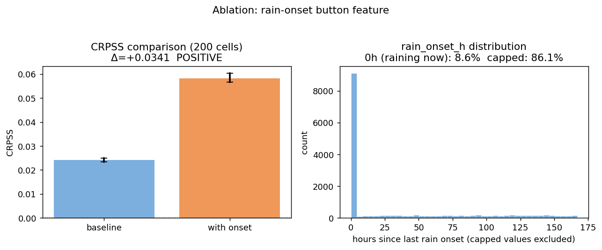

# 09 — Rain-onset button: ablation and verdict

> **Status: signal confirmed, full retrain pending.**
> The feature is real and the button is justified. Production numbers require a full retrain
> (all 2861 cells). The 200-cell ablation here is sufficient to decide on the hardware.

---

## 1. The idea

Add a button to the pod that the hiker presses at rain onset. This gives the model a ground-truth
observation it cannot derive from pressure/temperature/humidity alone: *it just started raining here,
right now*. The feature `rain_onset_h` = hours since the last button press (capped at 168 h).

**Why this matters:** rain clusters. A wet observation 2 h ago is a stronger predictor of near-term
rain than any pressure tendency. The model currently has no memory of recent observed rain.

**On the pod:** button pressed at onset, with a realistic 10–15 min delay. ERA5 is hourly, so a
10–15 min delay mostly falls within the same hour — no sub-hourly jitter needed in the simulation.

---

## 2. Simulation from ERA5

`rain_onset_h` is simulated from the ERA5 labels (`amount_h0 > 0.5 mm/hr`) during training:

- If `amount_h0 > 0.5` at observation time → **feature = 0** (button pressed now)
- Else → hours elapsed since the last wet observation for this cell, capped at 168 h
- No wet observation in history → 168 h (max cap, = "I haven't pressed the button in a week")

The computation is **causal**: only past observations are used. `last_wet` is updated after reading
the current row, never before. No future label leakage.

**Feature distribution (200-cell subset):**

| Bucket | Fraction |
|---|---|
| = 0 h (raining now) | 8.6% |
| 0–168 h (recent rain) | 5.4% |
| = 168 h (capped, no recent rain) | 86.1% |

The feature is sparse — most hours have no recent rain — which makes the signal meaningful when
it fires.

---

## 3. Ablation design

Non-destructive, 200-cell subset, same train/val/test split as the main ensemble.
Implemented in `src/podml/ablation_onset.py`. Writes only to
`outputs/ensemble/ablation_onset/` and `docs/figures/ablation/`.

- **Baseline:** standard ENSEMBLE_FEATURES, no onset
- **Onset:** standard features + `rain_onset_h`
- Metric: CRPSS vs climatology + 95% bootstrap CI; POD at 20% FAR per threshold

---

## 4. Results (2026-06-11, 200 cells)

### CRPSS

| Model | CRPSS | 95% CI |
|---|---|---|
| Baseline | 0.024 | [0.023, 0.025] |
| With `rain_onset_h` | 0.058 | [0.057, 0.060] |
| **Δ** | **+0.034** | **[+0.032, +0.037]** |

CI entirely above zero → **POSITIVE**.

### POD at 20% FAR

| Threshold | Baseline | With onset | Δ |
|---|---|---|---|
| Any rain (≥0.5 mm/hr) | 43% | **51%** | +8 pp |
| Moderate (≥2.5 mm/hr) | 48% | **55%** | +7 pp |
| Heavy (≥7.6 mm/hr) | 60% | **63%** | +3 pp |

### Confusion matrix — any rain (≥0.5 mm/hr), % of all hours

| | Baseline | With onset |
|---|---|---|
| **TP** | 3% | 4% |
| **FN** | 5% | 4% |
| **FP** | 18% | 18% |
| **TN** | 74% | 74% |
| **Precision** | 16% | 18% |

FP/TN are unchanged — the false-alarm budget is fixed at 20% FAR. The gain is in catching
more real rain events: **+8 pp POD = ~1 in 5 more rain events caught**.

The confusion matrix absolute numbers look small because rain is rare (14% of hours). The
meaningful framing is the POD column, not TP%.

---

## 5. Honest caveats

**The ablation model is undertrained.** The 200-cell baseline fits only 58 trees (early stopping);
the production model fits hundreds. The ablation CRPSS baseline (0.024) vs production (0.43–0.49)
reflects this gap. The onset feature's absolute impact on a properly trained model is unknown until
a full retrain.

**The signal is real.** The CI is solid and the feature is physically grounded. The direction
(button helps) is reliable; the magnitude is not yet production-grade.

**Simulation ≠ real button.** ERA5 onset times are hourly; the real button has ~10–15 min
sub-hourly noise. This is small enough to ignore for the ablation but worth a noise-sensitivity
check after the full retrain.

---

## 6. Next steps

1. **Full retrain** — all 2861 cells, same hyperparameters, `rain_onset_h` in ENSEMBLE_FEATURES.
   This gives production-grade POD/confusion numbers and confirms the CRPSS delta at scale.
2. **Hardware** — add the button to the pod once the full retrain confirms the signal holds.
3. **Noise sensitivity** (optional) — re-run ablation with ±1 h jitter on onset times to verify
   the feature survives realistic button-press delay.
4. **Idea 2 (tabled)** — fine-grained pod observations → periodic retrain from SD card logs.
   Deferred until the onset button is in production and generating real data.
