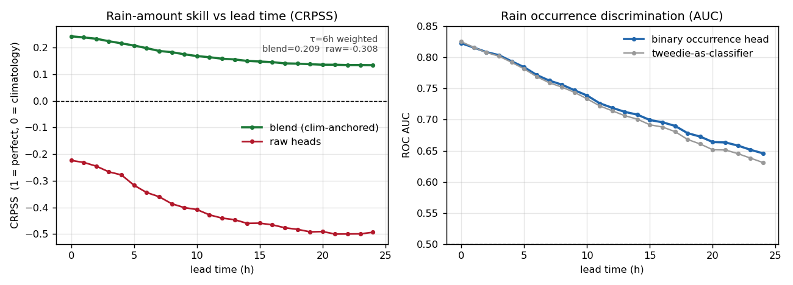
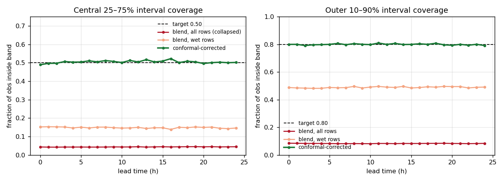
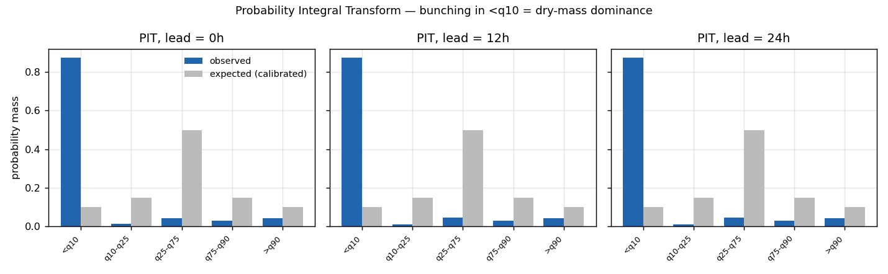
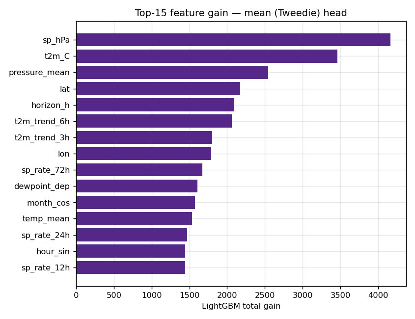
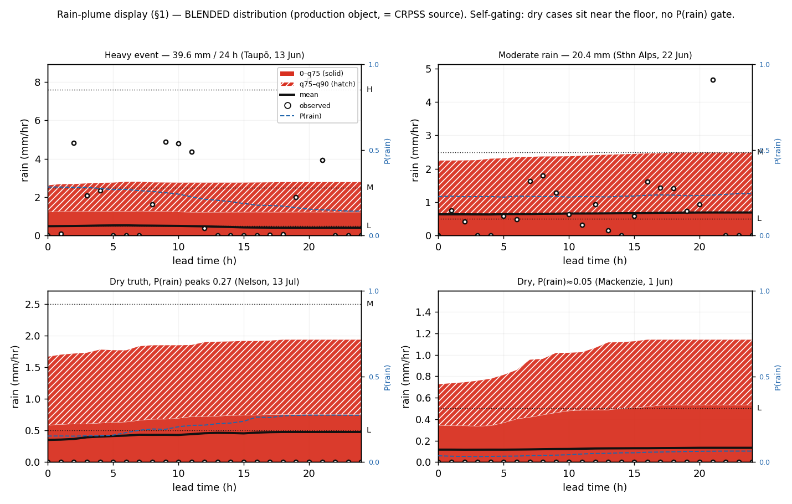

# 10 — Pod deployment, sync & the combined model

> **Living doc — discussion stage (2026-06-12).** No implementation, no code yet. Captures the decisions and
> open threads from the planning conversation so we can keep talking against a written reference. Carries the
> settled conclusions of 06–09: input/feature skill is at the **single-point physical ceiling**, so Phase 10 is
> **not** about improving the model — it's about getting the frozen model onto the pod and closing a field loop.

## 0. Framing
- **Single-user device, not a product.** Design calls are personal preference; no "end users" to protect. See [[feedback-single-user-project]].
- Phase 10 = **deployment + field loop**, split into two bodies of work: **(A) pod-side inference**, **(B) the sync loop**.
- Guiding property: the device must work **standalone**. The sync loop only makes the *next* model better — its failure degrades future improvement, never the live forecast.

## 1. Display — DECIDED
- **Rain → the phase-07 amount-fan** (mm/hr y-axis, fan shape). Inaccuracy **accepted for now** (single-user, knows the skill).
- **Temperature → fan** (already the correct tool).
- The exceedance-probability plume (phase 08) is **built but parked** — not re-pushed.
- **No gating** (confirmed decision): the fan reads bands off the **blended distribution** (model quantiles blended with per-cell climatology — the production object, = the CRPSS source). The climatology blend carries the dry point-mass, so it *self-gates* — narrow/floored when rain is unlikely, widening as P(rain) rises (dry q90 ≈ 1 mm/hr vs heavy ≈ 2.7, rendered in §1b). No P(rain) opacity gate, no hard threshold. The **`conformal`** CQR field is a wet-hour magnitude calibration for **eval coverage only**, **not** the display read — plotting it (+1–2 mm/hr) is what made an earlier draft's bands look far too wide.

### Rain plume spec — LOCKED (2026-06-12)
One-sided fan (rain is zero-floored), bands read off the **Tweedie predictive CDF** (any percentile, no retrain), within the 4-colour e-ink palette (black/white/red/yellow):
- **floor at 0**; no lower band (it's always zero).
- **mean** = centre line, **solid black**. (NB right-skew → mean often rides *above* q75; expected, not a bug.)
- band `0 → q75` → **solid red**
- band `q75 → q90` → **red, diagonal-stripe infill** (keep hatch coarse for ~200 px e-ink)
- band `q90 → q99` → **yellow**
- **rate-level reference lines** (horizontal, **dotted black**, drawn only where in y-range): light **0.5**, medium **2.5**, heavy **7.6** mm/hr. Labelled L/M/H.
- **Why these q's:** q75 inner = the likelihood cue (sits on the floor in dry stretches, lifts when the *conditional* forecast says rain likely — a continuous built-in soft-gate, no threshold); q90/q99 = amount range + tail risk. Upper-weighted on purpose (resolution where rain lives).
- **Two-channel read:** likelihood = fill density (solid→striped→yellow into the tail); severity = vertical position vs the L/M/H lines.
- Caveat: these unconditional tail q's are still **under-covered** (q90 ~31%) — right *shape*, magnitudes not calibrated; CQR/wet-conditional corrects later without changing the picture.
- Colour note: red/yellow here = *probability bands*; red/yellow on the **warning banner** = *severity* — deliberate re-use (severity now lives on the y-axis + L/M/H lines).

### Topo frame (1.54" 4-colour) — scheme PROVEN, work PARKED (2026-06-12)
Full exploration + originals + samples filed in **`experiments/topo_display/`** (see its README). Parked; not wired in.
- **Single layer: TOPO50 only.** Two-layer TOPO50+TOPO250 zoom **dropped** — too much complexity for the value.
- **Native window only, never downscale** (downscale = mud). **200 px window ≈ 0.85 km** square (TOPO50 = 4.233 m/px, from GeoTIFF) — an immediate-surroundings view, ~13–15 min walk across.
- **Pre-tile offline, stream one ~10 KB 4-colour tile from SD** per view (kills memory worry; never render source on-device). No Floyd–Steinberg dither (speckles line-art) — feature-class colour rules.
- **Locked colour scheme ("G-swapped"):** open ground → **yellow** (accent: clearings/tussock pop), bush → **white** (dominant bg, contours breathe on it), rivers/lakes → **red** (crossings/safety), contours+roads+tracks+text → **black**. Key insight: dominant terrain = white bg, minority = accent.
- **Caveat:** inverts LINZ convention (standard = white open / green bush) — more legible but "white = bush" reads backwards. Fine for a personal device ([[feedback-single-user-project]]).
- Optional later polish: thin to index contours only (needs vector/morphology) — white bg already makes this non-urgent.

## 1b. Coarse model — production baseline (training launched 2026-06-12)
The Phase-07 ensemble at full scale = the foundation for everything (the plume reads off its Tweedie CDF; the combined model §5 blends *onto* it).
- **Run:** VM `pid 62622`, log `ensemble_train_full.log`; full **2861-cell** cache (1,510,608 endpoints, 2014–2024; train 2014–22 / val 2023 / test 2024 → 30.9M/3.4M/3.4M long rows).
- **Feature set = final cut** (`ENSEMBLE_FEATURES = MODEL_FEATURES + horizon_h`): `sp_hPa`, `sp_rate_3/6/12/24/48/72h`, `rh`, `rh_trend_3h`, `t2m_C`, `t2m_trend_3h`, `month_sin/cos`, `hour_sin/cos`, `elevation`, `zone`, `horizon_h`. **No `rain_onset_h`** (button = offline truth only, §6).
- **Heads / flags** (`--from-cache --wet-quantiles --conformal --binary --save-plumes`): Tweedie mean (all-hours, blended w/ per-cell climatology + trust weights) + 4 wet-conditional quantiles (q10/25/75/90, wet rows) + binary P(rain) + conformal corrections.
- **Metrics — all captured:** in-run `metrics_overall.csv` = CRPSS (blend+raw)/horizon, all+wet+conformal coverage, PIT, **binary AUC** (vs Tweedie read-off), importance, weights. Post-training (`display_check {reliability,leadtime,geo,storm}` on saved models, **no retrain**) = reliability diagrams, POD/FAR leadtime, geo skill map, storm traces, confusion. ⚠️ binary AUC *metric* captured but binary *model* not persisted (save-loop gap — fix only if deploying that head).
- **Memory:** ~11 GB peak at the wide→long slice (leans on swap briefly); fits 11 GB RAM + 4.4 GB swap **only after the dataset downloads were cancelled** (done 2026-06-12 — watchdog cron lines removed; resume by re-adding them). Trainer carries only model-feature cols + `del`s the wide frame before slicing.
- **Expected skill** (from 200-cell diagnostics): blended CRPSS ~0.43–0.49 (h0→h24), the single-point physical ceiling; full-cell numbers below.

### Results — MEASURED (run finished 2026-06-12 03:37, clean, 5 models + metrics saved)
Source CSVs in `outputs/ensemble/` on the VM; figures regenerated locally by `experiments/baseline_figs/make_figs.py`. Run config: 2861 cells, 1,510,608 endpoints, test = 2024 (true distribution, untouched), 14.1% of rows wet.

**Bottom line:** positive rain-amount skill at all 24 lead hours, occurrence discrimination 0.65–0.82 AUC, and intervals that are well-calibrated **once the conformal layer is applied**. One caveat: full-grid skill landed at ~half the 200-cell diagnostic estimate (see fig 1 + the flag at the end).

#### Fig 1 — Skill vs lead time

**Left — CRPSS (Continuous Ranked Probability Skill Score).** CRPS measures how well a *probabilistic* forecast of rain *amount* matches what fell (lower = better, in mm/hr-ish units); CRPSS turns it into skill vs a reference, where **1 = perfect, 0 = no better than climatology, negative = worse than just quoting the seasonal average for that cell+hour**. The green **blend** (quantile heads anchored to per-cell climatology) is positive everywhere: 0.243 at nowcast → 0.198 (6h) → 0.159 (12h) → 0.134 (24h). Worked read: at 12h the forecast's CRPS is ~16% lower than climatology's. The red **raw** heads run −0.22 → −0.50 — *worse than climatology on their own*. That gap is the proof the climatology anchor is load-bearing: the quantile heads sharpen the distribution's shape, but without the floor they'd lose to "same as the seasonal average." Horizon-weighted aggregate (τ=6h): **blend 0.209, raw −0.308.**

**Right — binary AUC (rain vs no-rain discrimination).** AUC = probability the model scores a randomly chosen rainy hour higher than a randomly chosen dry hour; **0.5 = coin flip, 1.0 = perfect**. Mean **0.728**, decaying gracefully 0.823 (nowcast) → 0.713 (12h) → 0.646 (24h). The dedicated binary head (blue) beats reading occurrence off the Tweedie mean (grey) from ~10h onward (gain +0.004 → +0.015), so the separate head earns its keep at longer leads.

#### Fig 2 — Interval coverage (calibration)

Coverage = fraction of observations that actually fell inside a predicted band; a 25–75% band should contain **0.50** of obs, a 10–90% band **0.80**. The **red** line (blend, all rows) collapses to ~0.04 for the central band — but this is a **dry-mass artefact, not miscalibration**: 86% of hours are zero rain and sit *below* q25, so the central band lives entirely in near-zero territory and catches almost nothing. **Orange** (wet rows only) recovers to ~0.15. The **green** conformal-corrected line lands on target at **every** horizon: **25–75 band 0.49–0.52** (target 0.50), **10–90 band 0.79–0.81** (target 0.80). Takeaway: the intervals *are* trustworthy after conformal. (The parked plume's "q90 under-covered ~31%" caveat in §1 refers to the *unconditional* tail quantiles — a different read-off; the conformal path closes it.)

#### Fig 3 — PIT histograms (h0 / h12 / h24)

PIT (Probability Integral Transform) bins each observation by which predictive quantile band it fell in; a perfectly calibrated forecast matches the grey "expected" bars (0.10 / 0.15 / 0.50 / 0.15 / 0.10). Observed mass (blue) piles into the `<q10` bin (~0.87) — once more the **physical dry mass**: most hours are genuinely zero, so they land below the lowest *wet* quantile. This is the same single-point dry-mass signature, and crucially it's **near-identical across h0/h12/h24** — the calibration shape doesn't degrade with lead time.

#### Fig 4 — Feature importance (mean / Tweedie head)

LightGBM total-gain, top-15. Surface pressure (`sp_hPa`, gain ~4170) and temperature (`t2m_C`, ~3460) dominate, then the climatology prior (`pressure_mean`), location (`lat`/`lon`), `horizon_h`, temp tendency (`t2m_trend_6h/3h`), and pressure-tendency (`sp_rate_72/24/12h`). The two biggest levers — pressure and temperature — are **exactly the pod's two strongest physical sensors**, which is the encouraging part for on-device inference: the model leans hardest on signals the hardware actually measures well.

#### ✅ RESOLVED (2026-06-14 re-grade) — dilution flag does not apply to the production model
The original flag was the **§1b baseline run**: 200-cell diagnostic ~0.43–0.49 vs full-grid 0.13–0.24 (0.21 τ-weighted). That low number reflected the older **wet-conditional** config; the production **N** model is genuinely better. Re-grading the **production model** on the true/uniform 2024 test (`outputs/coarse_production/regrade/`) gives **τ6-weighted CRPSS blend = 0.514, raw = 0.534**, and the per-cell `geo` skill map shows **100 % of cells positive (median 0.53)** — no dilution. Skill is lowest in **Fiordland / deep south** (extreme rain, CRPSS ~0.10) and highest in the **drier central/eastern North Island** (~0.84) — the orographic story. *(NB: the production run's own `metrics_overall.csv` says 0.604, which is **contaminated** — graded on the enriched, too-dry v2 test; the honest number is 0.514. See [[project-v2-test-enrichment-bug]] and `coarse_production/regrade/`.)*

#### Display — rendered examples (what the §1 fan actually looks like)
Rendered from the baseline's saved `plumes.json` (20 real 2024 test cases) by `experiments/baseline_figs/make_display_examples.py`, reading the **`blended` distribution** — the production object the headline CRPSS is scored on (`train_ensemble.py:816`) and the one the display reads off ("CDF lookup on the blended distribution", `train_ensemble.py:11`). **Not** the `conformal` field (wet-hour CQR correction, +1–2 mm/hr — inflates the bands; belongs to eval coverage, not the display).

Each panel = the one-sided fan over 0–24 h lead: `0→q75` solid red, `q75→q90` hatched red, **mean = black line**, dotted L/M/H refs (0.5 / 2.5 / 7.6 mm/hr), **observed truth = white dots**, **P(rain) = dashed blue** (right axis). q99/yellow tail is omitted — only q10/q25/q75/q90 were trained, so q99 isn't available without a dedicated head or the Tweedie tail param (ties to the heads-vs-display seam: spec wants 75/90/99, model gives 10/25/75/90).

**The blend self-gates — no P(rain) gate needed** (confirms the §1 decision). Because the quantiles are blended with per-cell climatology (which carries the dry point-mass), they sit near the floor when rain is unlikely and widen as P(rain) rises: dry-case q90 ≈ 0.9–1.1 mm/hr vs heavy-case q90 ≈ 2.7. Compare the two dry panels (bottom) — narrow, hugging the floor — to the events (top). No wet/dry gating, no opacity trick: occurrence falls out of the blend itself.

**Honest caveat the fan exposes:** on the heavy event the observed dots (~5 mm/hr) sit **above q90** (~2.7) — the blended distribution **under-covers the heavy tail**. That's the convective/storm blind-spot, exactly what the storm-enrichment experiment below targets (sharpens q90/q99, won't fix no-precursor convection). Not a display bug — a real model limit, now visible.

> **⚠️ Correction log (2026-06-12) — wrong field, fixed.** The first version of these display figures read the **`conformal`** quantiles from `plumes.json`, not the **`blended`** ones. `plumes.json` carries five views per endpoint — `raw` / `blended` / `clim` / `conformal` / `p_rain` — and the production display + the headline CRPSS both use **`blended`** (`train_ensemble.py:816`, line 11). `conformal` is a wet-hour CQR magnitude correction for **eval coverage only**. Using it produced two wrong conclusions, both since reverted: (a) bands "far too wide", and (b) "the fan needs a P(rain) gate." Both were artefacts of the wrong field. Concrete gap (example 0, h=0): `blended` q75/q90 = **0.42 / 1.25** mm/hr vs `conformal` q75/q90 = **2.17 / 4.45** — the conformal CQR offsets (+1.22 / +1.84) are what inflated it. **Rule going forward: anything user-facing or skill-scored reads `blended`; `conformal` is eval-coverage only.**

### Storm-enrichment experiment (spec'd 2026-06-12 → run tomorrow, non-destructive)
**Why:** more data won't move the headline (single-point ceiling, v3 cut all features). The ONLY data-limited regime is the **heavy tail** (q90/q99 + storm blind spot) — event-scarce.

**How the current sampling misses storms** (`build_ensemble_dataset`, `train_ensemble.py:126`): triple loop year→month→cell; for each (cell,month) it picks `k=4` hours **uniformly at random, label-blind** (`rng.choice(valid_pos, size=4, replace=False)`). A storm is a few hours in a ~720-hr month, so 4 random picks almost always miss it → storms enter at their true (rare) base rate. **"Events we were missing" = real heavy hours in the GPM that were never sampled** (not reweighting — genuinely new tail samples).

**Data available (VM disk, corrected 2026-06-12): GPM 2002–2025, ERA5 core 2000–2025** — both present every year. So extending years is feasible NOW; current cache is only 2014–2024.

**Experiment design (separate cache dir + output dir, baseline untouched):**
1. **Stratify line 126** — oversample/guarantee endpoints whose forward window has heavy rain (≥2.5 / ≥7.6 mm/hr): captures missed storms in years we already have.
2. **Extend years** toward 2002–2024 for *new* storm events (down-weight pre-2014 TRMM-era — weaker heavy-truth, validate it doesn't degrade post-2014).
3. **Quantile heads ONLY** see the enriched tail; **mean head stays on the true base rate** (else P(rain) inflates → false alarms).
4. **Test = 2024, untouched, true-distribution** — never enrich the test or the metrics lie.
5. Compare to baseline: heavy-rain POD + q90/q99 coverage + heavy CRPSS, **bootstrap CIs**.
6. **Honest ceiling:** sharpens *forecastable* (frontal) heavy rain; CANNOT fix the convective blind spot (no precursor in features — info problem, not sample count). Success = tighter q90/q99 + higher frontal heavy POD; blind-spot storms staying flat is expected, not failure.

**⚠️ MEMORY — the gating constraint for tomorrow.** Tonight's baseline (1.51M endpoints → 38M long rows) already peaked ~11 GB, leaning on swap. Extending years (~2×) and/or adding storm endpoints **~doubles the row count → ~22 GB peak → will NOT fit 11 GB RAM + 4.4 GB swap.** Before the enriched build/train, do ONE of (pref order, per [[feedback-simplicity-over-memory]]):
- **Add swap (live, no disruption, recommended):** `sudo fallocate -l 16G /swapfile2 && sudo chmod 600 /swapfile2 && sudo mkswap /swapfile2 && sudo swapon /swapfile2` → ~20 GB swap. Remove later: `sudo swapoff /swapfile2 && sudo rm /swapfile2`.
- **Cap the row count:** keep total `k` ~constant (stratified *replacement* not addition — e.g. 2 uniform + 2 storm picks) and/or limit extra years, so the long frame doesn't balloon.
- **Fallback (algorithm, last resort):** recover `expand_split_long` (per-split expansion, removed 2026-06-09, in git history) so peak RAM tracks the largest split, not the whole frame ×2.

See [[project-07-ensemble-plan]].

## 1c. Stratified model **v2** — SPEC (decided 2026-06-12, in build)
A clean retrain that supersedes the §1b baseline for the live forecast. Locks the display to a 3-band upper fan, enriches rain in training (calibrated, not biased), drops the binary head entirely, and ships a detailed confusion matrix. Baseline (§1b) and its `outputs/ensemble/` are **untouched** — v2 builds to its own cache + output dirs.

### Decisions (this conversation)
- **Quantiles → `[0.50, 0.75, 0.90]`** (was `[0.10,0.25,0.75,0.90]`). The lower half is wasted under zero-inflation (median pins to 0), so the fan is upper-only. Keep the **Tweedie mean** head (anchors the climatology blend that makes the bands self-gate).
- **Display = bottom-aligned 3-band fan**, read off the **`blended`** distribution (per [[feedback-plumes-blended-not-conformal]]):
  - `0 → q50` — **solid red**
  - `q50 → q75` — **red, diagonal-line infill**
  - `q75 → q90` — **yellow**
  - Floor at 0 (rain zero-floored); dotted L/M/H refs (0.5/2.5/7.6 mm/hr) retained.
- **NO binary rain gate** — no `--binary` head, no P(rain) gate (hard *or* soft). Occurrence is carried implicitly: the blended q50/q75/q90 self-gate (climatology blend + feature conditioning ⇒ bands collapse to the floor on dry-looking hours, lift on wet). This is the confirmed direction; the gate ideas in §1/[[project-08-rain-display]] are closed.
- **Stratified database — "more rain, calibrated":**
  - **2014–2024** (existing span): stratify the line-126 sampler to enrich **all** rain (light/moderate/heavy), targeting **~30% wet** endpoints vs the natural ~14%. Guarantee every heavy (≥2.5 mm/hr) hour per cell-month, then fill favouring wet.
  - **2002–2013 storm-tail harvest:** pull **only heavy (≥2.5 / ≥7.6 mm/hr) endpoints** from the earlier years for *new* tail events, **down-weighted** (TRMM-era, weaker heavy-truth) — they enrich the q90 tail without dominating the bulk.
  - **Importance weights** restore the **true base rate** in the quantile + mean loss, so oversampling adds *examples* without biasing the bands wet (keeps self-gating honest). w_i = p_true(stratum)/p_sampled(stratum), heavy-harvest years carry an extra TRMM down-weight.
  - **Test = 2024, untouched, true distribution** — never enrich test or the metrics lie.
- **Detailed confusion matrix:** P(rain ≥ thr) derived from the **blended quantile CDF** (no binary head). Thresholds **0.5 / 2.5 / 7.6 mm/hr** × lead-time bands, full **TP/FP/FN/TN + precision/recall/POD/FAR/F1/CSI**, reported both as a **probability sweep** and **called out at the 10% FAR** operating point. Motivated by the precision finding (≈⅓ PPV at 10% FAR, ≈0.89 NPV — good dry-detector, weak rain-confirmer).

### Build / run plan
1. **Memory:** add 16 GB swap on the VM first (`/swapfile2`, per §1b) — the harvest stays modest (tail-only earlier years) but be safe.
2. **Code (local, tested before deploy):** (a) `QUANTILE_LEVELS`/`QUANTILE_ALPHA` → q50/75/90; (b) stratified sampler + importance-weight column in `build_ensemble_dataset`; (c) wire `sample_weight` into the mean + quantile `lgb` fits; (d) confusion-matrix module (sweep + fixed-FAR); (e) new 3-band display renderer; (f) drop `--binary` from the run. Native unit + integration tests per [[feedback-test-workflow]].
3. **Build** the v2 stratified cache (separate dir), **train** (mean + q50/q75/q90, `--from-cache --conformal`, no `--binary`), **eval** (CRPSS + the confusion matrix + display examples).
4. **Update this doc** with v2 results vs the §1b baseline + figures.

### The two models trained today (2026-06-12) — what each is, and why both
This doc is read to **assess** the model, so be explicit: today produces **two** trained ensembles from the *same* v2 cache. Only one is a deployment candidate.

| | **v2-full** (production candidate) | **v2-no-harvest** (ablation only) |
|---|---|---|
| Training data | stratified 2014–2024 (~30% wet, importance-weighted to true base rate) **+ 2002–2013 heavy-storm harvest** (w=0.5) | **identical**, but the 2002–2013 harvest rows have their weight zeroed (`--no-harvest`) |
| Purpose | the model that would go on the pod | a measuring stick — isolates *what the harvest does* |
| Saved | yes (`outputs/ensemble_v2_full/`) | metrics only, no models (`outputs/ensemble_v2_noharvest/`) |

**Why both:** v2-full and v2-no-harvest are identical except for the earlier-year storm harvest, so **differencing them on the untouched 2024 test isolates the harvest's effect** — nothing else changed. The report reads that diff two ways:
- **Benefit:** does the harvest *raise* heavy-rain POD and q90 coverage on real storms? (the reason we added it)
- **Cost:** does it *hurt* dry accuracy — FAR rising at fixed POD, or `cov≤q50` drifting off 0.50? (the feared side-effect)

That is the **case-1-vs-case-2 verdict** (sharpen storms at small dry cost ✓, or large dry cost ✗). The §1b baseline is the *third* reference — v2-full vs §1b shows the combined effect of the new q50/q75/q90 fan + stratification + harvest.

### What the v2 report must let you assess (the assessor's checklist)
Each item below ships as a figure **with in-place commentary**: the metric defined, its units, a worked example, and **what to look for** ([[feedback-report-grounded-examples]]). Wired up in `src/podml/report_v2.py` (runs on saved models, no retrain).

1. **Skill** — CRPSS vs lead time (v2-full vs §1b baseline vs climatology=0). *Q: is it better than predicting the seasonal average, and better than the old model?*
2. **Calibration** — `cov≤q50/q75/q90` vs targets + PIT + **reliability diagram** for P(rain≥thr). *Q: when the band says "75th percentile", is truth below it 75% of the time? When it says 30% chance, does it rain ~30% of the time?*
3. **Discrimination** — the confusion matrix (precision / POD / FAR / CSI) at 0.5/2.5/7.6 mm × lead-time + a **PR curve**. *Q: when it calls rain how often is it right (precision); when it says "clear" how often right (NPV); what does a true alarm cost in false ones?*
3b. **Amount accuracy, rewarding closeness** (`report_v2.py`, built) — two complementary continuous-verification graphs, 5-panel small multiples (0/3/6/12/24 h):
  - **Conditional quantile diagram** — bin by predicted mean, show the *observed* distribution (median + IQR + 10–90) per bin vs the 1:1 line. Median on the diagonal = accurate; box height = honest spread. The field-standard precip-verification plot.
  - **Observed × predicted density** — 2-D log-density heatmap = the "continuous confusion matrix"; bright ridge on the 1:1 line = accurate, off-diagonal mass = how-wrong (near-miss vs gross-miss). *Q: are forecasts close to truth, and does closeness decay gracefully with lead?* (4×4 none/light/mod/heavy contingency table is the discrete companion.)
4. **Sharpness** — mean band width (q90−q50) by lead time and wet-vs-dry. *Q: are the bands informatively narrow, or calibrated-but-uselessly-wide?* (A wide band can be "calibrated" and still useless.)
5. **Geography** — per-cell CRPSS **map** over NZ ([[feedback-loves-graphs-maps]]). *Q: which valleys/coasts do I trust, which not?*
6. **Representativeness of the displayed plume examples** — see below. *Q: are the 20 shown cases typical, or cherry-picked?*
7. **Failure modes** — the convective/storm blind-spot surfaced explicitly (truth landing above q90), not hidden.

### Plume examples — representativeness commentary (required, not optional)
The display examples are only trustworthy as evidence if you know **how they sample the real distribution.** The report will, alongside the rendered fans:
- Plot **all** 2024 test endpoints in (predicted-mean × observed-rain) space (2-D density) with the **20 examples overlaid** — showing whether they span dry → light → heavy rather than clustering.
- A small **coverage table**: how many of the 20 fall in each (elevation zone × season × intensity) bin vs that bin's share of the test population.
- **Plain-language verdict** in the text: are the examples representative, and if skewed, in which direction (e.g. "over-weighted to West Coast heavy events; dry-coast hours under-shown"). No silent cherry-picking.

### Open / watch
- Importance-weight variance on the dry side at ~30% wet (chose moderate over aggressive to limit this).
- Whether 2002–2013 heavy-truth (TRMM-era) actually helps the post-2014 tail or just adds noise — validate q90 coverage doesn't degrade on the true-distribution 2024 test.
- q90 is the top band; the heavy tail above q90 stays under-covered (the convective blind-spot — info problem, not sample count). v2 should *tighten* q90, not claim to fix convection.

## 2. (A) Pod-side inference — TO DISCUSS
- Frozen LightGBM ensemble → **compact tree-array interpreter in flash**, model as **swappable data file on SD** (no reflash to update). Not m2cgen.
- On-device feature vector with **bit-for-bit parity** to `features.py` (the contract).
- Render the **07 fan** on the 4-colour e-ink; recompute/redraw cadence ~30 min, decoupled from the 5-min log.
- (Detail deferred — this is the most mechanical chunk, not yet worked through.)

## 3. (B) The sync loop — SD card carries pod logs to the VM
- Sync performs three functions: **error logging · calibration · (re)training**.
- **Error logging is the substrate** (the other two consume it). Two paired streams, append-only / keep-complete:
  - **sensor-vs-reference** (pod reading vs a reference at same place/time) → feeds calibration.
  - **prediction-vs-truth** (what the forecast said vs what happened) → feeds training + a skill-over-time monitor.

## 4. Calibration
- Closes the loop `sensorsim.py` was stubbed for (its magnitudes are currently guesses).
- **Constant bias → correct at VM ingestion**, not in the model and not on the pod (cancels in pressure *tendencies* anyway; only touches absolute level; cheap, drift-robust).
- **Noise → inject measured magnitudes into sensorsim training** (esp. humidity — the most damaging channel) so the model stops trusting precision the sensor lacks.
- **Pressure thermal coefficient → measure on the bench** (constant true pressure, sweep temperature), NOT from field data (ambient temp & pressure are meteorologically coupled → field regression aliases weather into a fake sensor coefficient).
- Reference for sensor *state* = Open-Meteo (slow physical fields, hourly fine). NOT for rain truth (model output, circular).

## 5. The combined model (a.k.a. "retraining")
> **Superseded by `model_architecture.md` (refined 2026-06-14).** The combined model is now a **three-way**
> mix — **coarse + climatology + fine** — with **emergent** (not hardcoded) horizon ownership, fitted by a
> stacking/gating weight model over `(cell-features, horizon)`. The bullets below are the original two-way
> sketch, kept for history; read `model_architecture.md` for the live design.
- Reframe **fine-vs-coarse → horizon-dependent blend** (the nowcast-vs-NWP "seamless blending" pattern):
  - **fine model** owns **0–3h sharp events** (fast fronts / blips) the hourly coarse model structurally can't see.
  - **coarse model** owns **6–24h** synoptic forecast.
  - blend weight is **horizon- AND location-dependent**; reuse the existing `w(cell)` machinery.
- "Finer sensors" earns its keep via **temporal resolution** (5-min resolves a frontal pressure-V that hourly aliases), not more info at long lead.
- Data-scarcity caveat: the local/fine part is a **small, regularised correction shrunk toward the global model** (partial pooling) — NOT a free-standing 3000-tree GBM. Full GBM retrains stay a **manual VM job** when enough truth has accumulated.

## 6. Button — REMOVED from the design (2026-06-13)
> **Superseded.** The rain-onset button was **dropped from the hardware** (along with the compass, accelerometer,
> and buzzer — see `/CLAUDE.md` and `pod/docs/architecture.md`). There is **no button**. The fine-side truth it
> was meant to provide is now **GPM-Late** (amount, point, recent — `12-recent-gpm-fine-labels.md`), joined to
> the pod's `/pred` on UTC issue-hour offline on the VM. `09-onset-button.md` is retained as research history.
- Historical decision (now moot): the button would have been **offline truth only** — logging + post-sync
  training/validation, never a live prediction input — knowingly declining the +0.034 CRPSS the phase-09
  ablation measured, to keep the live forecast button-independent. With the button gone, the live forecast is
  purely P/T/RH regardless, and the offline truth role passes to GPM-Late.

## 7. Truth sources — by use
- **Sensor calibration** → Open-Meteo (adequate; on-demand by request from the logs).
- **Rain truth, backcountry point** → **GPM-Late** (`GPM_3IMERGHHL`, ~14 h latency, amount mm/hr at the point,
  joined on UTC issue-hour — `12-recent-gpm-fine-labels.md`). This is the fine-side truth, replacing the removed
  button. Satellite-observation based, same family as the coarse model's GPM labels (vs ERA5/Open-Meteo =
  circular model product).
- **Rain truth, corpus (build/weight the fine model where coverage is good)** → **MetService 1-min AWS gauge** (sub-hourly *observed* mm) and **radar/QPE** if licensable.
  - Self-serve MetService = forecasts only (wrong shape, circular). Observations/radar = `nzsales@` commercial route. **Email sent (2026-06-12), awaiting reply** on: obs/archive pricing + whether the licence permits **derived model weights with storage**.
  - Open-Meteo `minutely_15` is NOT a real upgrade for NZ (interpolated from hourly).
  - RainViewer = display tiles, not QPE + commercial-bespoke → wrong shape. See [[nowcast-direction]].

## 8. Open / next
- **DONE (2026-06-12):** baseline run finished clean, `metrics_overall.csv` read, summary figures built (§1b Results, `experiments/baseline_figs/`). Full-cell CRPSS came in ~½ the 200-cell estimate — see the flagged TODO.
- **Immediate (next):** run `display_check {reliability,leadtime,geo,storm}` + `report_ensemble` on the saved models (no retrain) for the full suite — esp. **`geo`** to resolve the skill-vs-200-cell gap (zone/elevation stratification).
- (A) pod-side inference walked through in detail (interpreter, parity, render).
- Combined-model mechanics: what the local correction actually *is* (residual? recalibration?) and how `w` is refit per sync.
- Where the source-of-truth precision floor lands once the MetService reply comes back.
- **Storm-stratified enrichment experiment** (§1b) — gated on resuming pre-2014 GPM; quantile-heads-only; measure vs baseline.
- **Binary-head persistence fix** — only if deploying the dedicated P(rain) head (vs the Tweedie read-off).
- Resume the cancelled dataset downloads when training is done (re-add the 3 watchdog cron lines).
- Whether to write the full plan up (vs keep as bullets) once the above firm up.
