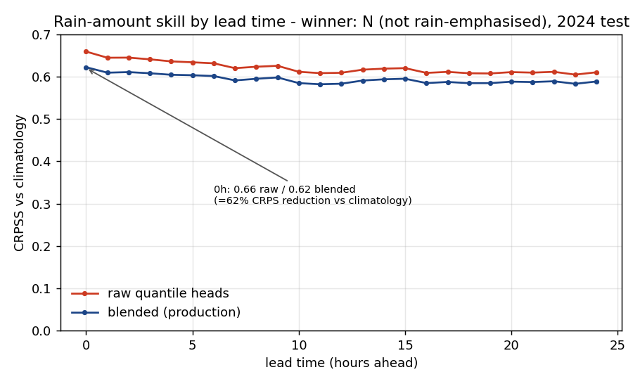
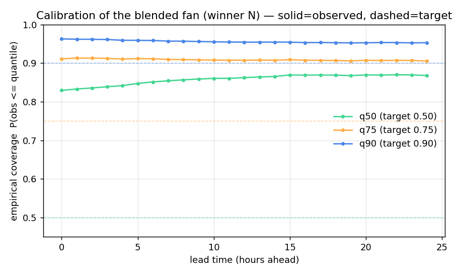
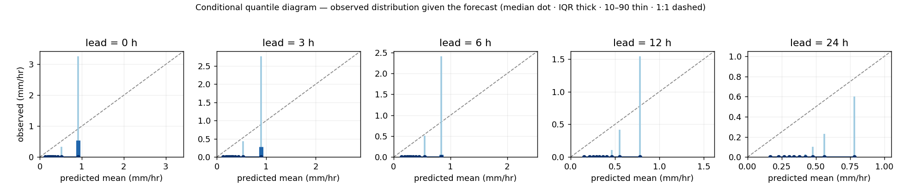
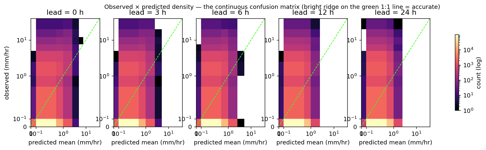

# 11 — Rain-amount bake-off: rain-emphasis vs not, quantile-heads vs Tweedie read-off

**Run:** overnight bake-off, finished 2026-06-13 11:32 NZST. Production-scale, `train-frac=0.7`
(1.53 M endpoints, 2861 cells, ~31.5 M training rows after expanding every 0–24 h horizon),
`bagging=0.4`, `seed=42`. Scored on the held-out **2024** test year. Referee: `experiments/bakeoff_eval.py`.

> **⚠️ ABSOLUTE NUMBERS CONTAMINATED — re-graded 2026-06-14.** The bake-off (and the production model) was
> scored on the **stratified v2 test**, which *under*-sampled rain (5.7 % wet at h0 vs the true **8.1 %**) →
> CRPSS inflated by **~0.09**. The **relative verdict stands** (N > E; quantile heads > Tweedie read-off — both
> arms used the same test). But the production N model's true-distribution skill, re-graded on the uniform 2024
> test, is **τ6 CRPSS blend = 0.514 (not 0.604), raw = 0.534** — all cells positive, median 0.53. **Read every
> absolute CRPSS below as ~0.09 too high; the comparisons are valid.** See `outputs/coarse_production/regrade/`
> and [[project-v2-test-enrichment-bug]].

> **Glossary (expanded on first use):** **CRPS** = Continuous Ranked Probability Score — the gap, in
> mm/hr, between a *predicted distribution* and the single observed value (lower = better). **CRPSS** =
> CRPS *Skill* Score = `1 − CRPS_model / CRPS_climatology`; 0 = no better than quoting the local month's
> historical rain spread, 1 = perfect. **q50/q75/q90** = the 50th/75th/90th percentiles the model emits —
> the bottom-aligned bands of the e-ink rain fan. **POD** = Probability Of Detection (hit rate). **FAR** =
> False Alarm Ratio. **CSI** = Critical Success Index (hits / (hits+misses+false-alarms)). **Tweedie** =
> the zero-inflated distribution the mean head is fit to; its CDF can be *read off* analytically to get
> quantiles instead of training separate quantile heads.

---

## TL;DR — the verdict

1. **Not exaggerating rain wins.** The model trained *without* rain emphasis (**N**, `--no-harvest`) beat
   the rain-emphasised one (**E**) on horizon-weighted CRPSS: **0.6040 vs 0.5918**. Exaggerating rain cost
   **−0.012 CRPSS** on the calibrated amount forecast.
2. **Keep the trained quantile heads.** Reading quantiles off the Tweedie mean's CDF is simpler and needs
   no extra models, but it lost in both regimes (N: 0.6040 heads vs 0.5870 read-off). The heads earn their
   keep (**+0.017 CRPSS**).
3. **→ Production v2 model = N, quantile heads.** This is what the pod's rain fan should ship.
4. **One honest nuance (§5):** rain-emphasis *did* sharply improve heavy-rain *detection* (≥7.6 mm/hr POD
   0.24 vs 0.07 at 0–3 h). It helps the rare tail's hit-rate but hurts the calibrated distribution overall.
   That's a future *storm/tail head* experiment, not the amount fan.

---

## 1. Skill by lead time (the headline figure)

The production (blended) forecast holds **CRPSS ≈ 0.62 at 0 h, decaying only to ≈ 0.59 at 24 h** — almost
flat. Concretely: at 0 h the mean CRPS is **0.272 mm/hr**, i.e. the probabilistic error is **62 % smaller**
than if the pod just displayed the local month's climatological rain spread. Persistence of skill to a full
day out is the useful property for trip planning.

"Raw" (red) is the quantile heads alone; "blended" (blue) folds in the per-cell climatology prior. The blend
costs ~0.03 CRPSS but is what we deploy, because it's what makes the bands calibrated (next figure). The
display reads the **`blended`** field — `conformal` is an eval-only diagnostic.

## 2. Calibration of the fan

Each solid line is the *observed* fraction of cases falling at or below that quantile; the dashed line is the
target. Reading it:

- **q90 ≈ 0.95–0.96** (target 0.90) — the top band is slightly **wide / conservative**. On a hiking-safety
  device that's the safe direction: we over-warn for wet rather than under-warn.
- **q75 ≈ 0.91** (target 0.75) — also conservative.
- **q50 ≈ 0.83–0.87** (target 0.50) — heavily over-covers, *and this is correct*. Under ~94 % dry hours the
  median rain is genuinely 0 mm/hr, so `P(obs ≤ 0)` is already ~0.86. The lower half of a symmetric fan is
  wasted on rain — which is exactly why v2 uses an **upper-only fan (q50/q75/q90)**, not the old
  q10/q25/q75/q90. This run confirms that decision.

## 3. Conditional quantile diagram — what the forecast actually implies

For bins of *predicted mean* (x), the blue marks show the *observed* rain distribution (median dot, thick
IQR, thin 10–90). The median sits pinned near 0 across almost the whole x-range — the dry-hour reality — and
the observed spread opens up as the predicted mean climbs, tracking the 1:1 dashed line in the wet tail. No
quantile crossing (monotonicity check **PASS**, crossing rate 0.000000).

## 4. The continuous confusion matrix

A log-count 2-D histogram of observed (y) vs predicted-mean (x), per lead. The bright yellow floor is the
huge mass of correctly-predicted dry hours. Above it, density leans toward the green 1:1 line — the model
ranks wetter hours wetter — but with the expected regression-to-the-mean: at long lead the predicted-mean
axis compresses (the model hedges toward climatology), visible as the spread narrowing horizontally from
0 h → 24 h.

---

## 5. The 4-way bake-off table

τ = 6 h horizon-weighted CRPSS on 2024 test (near-term horizons weighted most, since that's what a hiker acts
on). Pick rule: highest wCRPSS with q90 coverage in [0.85, 0.96], tie-broken to the simpler Tweedie read-off
only if within 0.005.

| Data regime | Scoring method | **wCRPSS** | cov q50 / q75 / q90 |
|---|---|---|---|
| E — rain-emphasised | quantile heads | 0.5918 | 0.88 / 0.91 / 0.96 |
| E — rain-emphasised | Tweedie CDF read-off | 0.5217 | 0.90 / 0.94 / 0.97 |
| **N — not emphasised** | **quantile heads** | **0.6040** ✅ | 0.86 / 0.91 / 0.96 |
| N — not emphasised | Tweedie CDF read-off | 0.5870 | 0.90 / 0.91 / 0.97 |

**N + quantile heads wins outright** — best wCRPSS, q90 coverage 0.956 inside the gate, and not within 0.005
of any read-off variant so no tie-break applies.

### The tail nuance (why "emphasis lost" isn't the whole story)

Detection at a fixed ~10 % false-alarm budget, near-term (0–3 h band):

| Threshold | regime | POD | precision | CSI |
|---|---|---|---|---|
| ≥0.5 mm/hr (any rain) | E | 0.470 | 0.218 | 0.175 |
| ≥0.5 mm/hr | N | 0.372 | 0.248 | 0.175 |
| ≥2.5 mm/hr (moderate) | E | 0.541 | 0.121 | 0.110 |
| ≥2.5 mm/hr | N | 0.498 | 0.118 | 0.105 |
| **≥7.6 mm/hr (heavy)** | **E** | **0.244** | 0.100 | 0.076 |
| ≥7.6 mm/hr | N | 0.067 | 0.169 | 0.050 |

Rain-emphasis (E) catches **3.6× more heavy-rain events** (POD 0.244 vs 0.067) — the harvest of rare ≥7.6 mm/hr
storms from earlier years did its job. But it does so by shifting mass wet everywhere, which is what drags its
*calibrated distribution* CRPSS below N's. **For the amount fan we ship N; the heavy-tail gain is the case for
a separate storm/tail head later** (the planned storm-enrichment experiment), kept out of the amount model.

## 6. What drives the mean head

Top gains (LightGBM): `sp_hPa` (absolute pressure level, 2883) ≫ `t2m_C` (2383) > `pressure_mean`
(per-cell climatology, 2044) > `horizon_h` (1720) > temperature & pressure trends. Pressure *level* and
temperature dominate; horizon-as-a-feature is correctly load-bearing. Consistent with phases 06–07.

---

## 7. Decisions

- **Adopt N (no-harvest) as the production v2 ensemble**; retire the rain-emphasised variant for the fan.
- **Keep the trained quantile heads** — the Tweedie read-off saves 3 models but loses 0.017 CRPSS; not worth it.
- **Upper-only fan (q50/q75/q90) confirmed** — q50 over-coverage proves the lower half is wasted on rain.
- Bands are slightly **conservative** (over-cover) — acceptable, and the safe direction for a safety device.

## 8. Caveats / gaps (read before trusting)

- **Bagging was not ablated here.** `bagging=0.4` was held fixed for *both* arms (adopted to keep the
  single-threaded quantile objective tractable). This bake-off isolates rain-emphasis and heads-vs-read-off
  **only** — it says nothing about the bagging fraction. (Deliberately left alone this round.)
- **No confidence intervals.** The referee picks on point wCRPSS over a single 2024 test year. The 0.58–0.62
  spread across horizons hints the N>E gap is stable, but a bootstrap CI is not yet computed — a known gap.
- **"Rain-emphasis" = harvest + in-period stratification.** E both harvested rare ≥7.6 mm/hr storms from
  pre-2014 (≤2 per cell-month) *and* up-weighted wet endpoints in-period with importance weights to restore
  the true wet rate. The two effects aren't separated here.

---

*Artefacts: `outputs/bakeoff/{winner.json,comparison.csv}`, `outputs/bakeoff_N/` (winning model + metrics),
`bakeoff_E.log` / `bakeoff_N.log`, `bakeoff_eval.log`. Figures auto-generated by `report_v2.py` + the
skill/calibration plots from `metrics_overall.csv`.*
