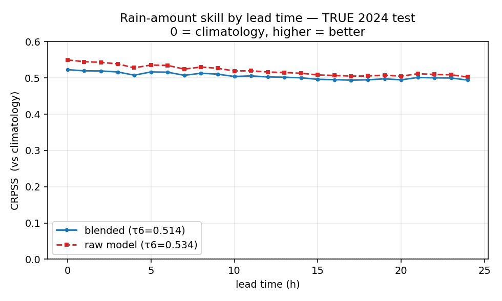
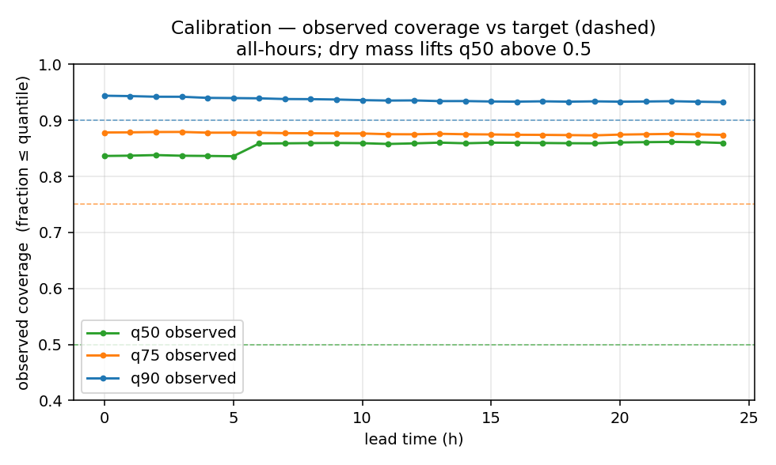
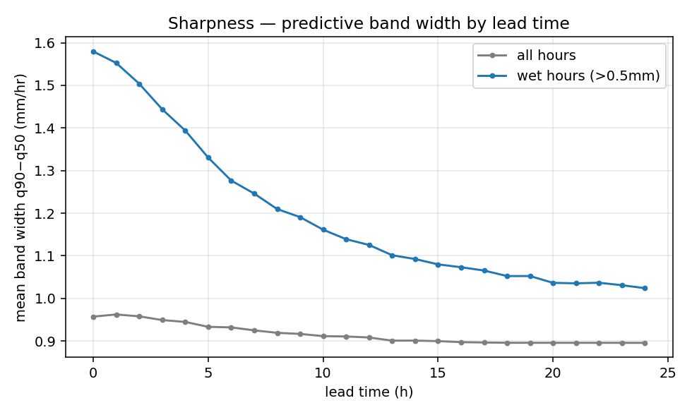
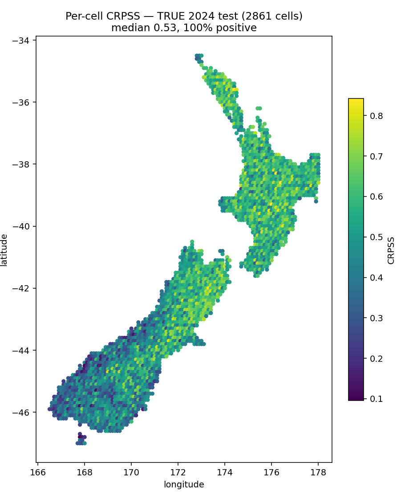
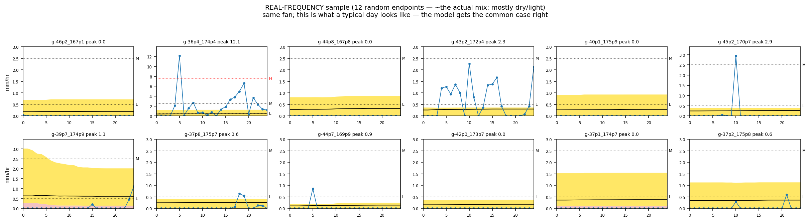
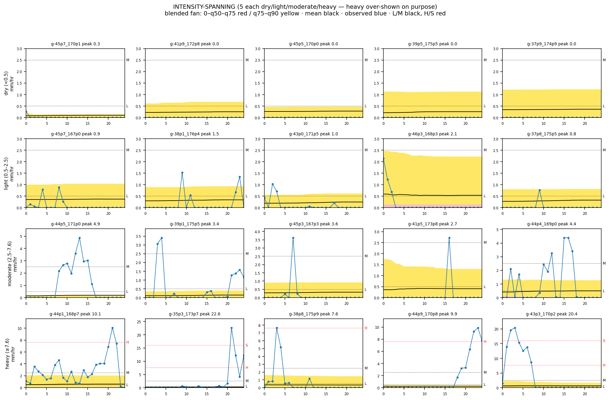

# Coarse Model — Assessment Report

> **What this is:** the production **coarse** rain-amount model (the ERA5-trained global ensemble — the "N"
> bake-off config, no bagging), assessed on the **true / uniform 2024 test** (3.43 M endpoint×horizon rows,
> 2861 NZ cells). Read this to judge how good the coarse model actually is. It is **Stage 0** of the combined
> forecast ([[model_architecture]]) — the baseline any fine model must beat.
>
> **Provenance / honesty note (2026-06-14):** these numbers are the **re-graded** ones, scored on the
> uniform cache `outputs/ensemble/dataset`. The model's own `outputs/coarse_production/metrics_overall.csv`
> says CRPSS **0.604** — that is **contaminated** (graded on the enriched v2 test, which under-sampled rain to
> 5.7 % vs the true 8.1 %, inflating skill by ~0.09). **The honest number is 0.514.** Figures auto-generated by
> `experiments/coarse_model_figs.py`.

## What's being measured — two numbers, read them right

This report has **two** CRPSS lines, and they are different objects:
- **raw = the pure coarse model** — the ERA5-trained ensemble alone (**τ6 = 0.534**).
- **blended = coarse + per-cell climatology** — the model mixed with each cell's historical rain (**τ6 = 0.514**).

So the headline **0.514 is the coarse *+ climatology* blend**, not the coarse model in isolation. This production
object **welds climatology into coarse** (the old two-way design); the three-model architecture
([[model_architecture]]) **separates** them — there, the **raw 0.534** is the *coarse term* and climatology is its
own term alongside. Throughout this report, "blended" = coarse+climatology, "raw" = pure coarse.

## Bottom line

The **coarse + climatology** blend is a **genuinely skilful distributional forecaster of rain *amount***:
**τ6-weighted CRPSS = 0.514** (pure coarse alone: 0.534), **positive in 100 % of cells**, and **flat from
0 → 24 h** — real skill a full day out. Its **one serious limitation** is the wet tail: the displayed bands are
well-calibrated *marginally* but **badly under-cover the amount whenever it actually rains** (q90 catches only
~25 % of ≥0.5 mm events). That is the single-point physical ceiling — rain *amount* is governed by instability /
moisture / uplift that surface pressure/temp/humidity simply don't contain (an **information** limit, not a
sampling-rate one) — and it's the gap the fine model exists to chip at.

---

## 1. Skill by lead time

**CRPSS** = Continuous Ranked Probability *Skill* Score: `1 − CRPS_model / CRPS_climatology`, where CRPS is the
gap (in mm/hr-ish units) between the *predicted distribution* and the single observed amount. **0 = no better
than quoting this cell's historical rain spread for the month; 1 = perfect; negative = worse than climatology.**

- The **blended** forecast (model quantiles folded with the per-cell climatology prior) holds **0.52 at
  nowcast → 0.49 at 24 h** — almost flat. Worked read: at 12 h the forecast's CRPS is ~50 % lower than just
  quoting the seasonal average. Persistence of skill to a full day out is the useful property for trip planning.
- The **raw** model (quantile heads alone) edges the blend by **~0.02 at every lead** (τ6 0.534 vs 0.514). The
  climatology blend is a small, deliberate accuracy cost paid for the dry-mass / self-gating behaviour — see §2.
  *(This is why the combined model feeds the raw coarse, not the blended one — [[model_architecture]] §2.)*

## 2. Calibration — the zero-inflation paradox

Coverage = the fraction of observations that actually fall at or below a quantile band; a calibrated q90 should
sit at **0.90**, q75 at **0.75**, q50 at **0.50** (the dashed targets).

- **Marginally, the bands *over*-cover:** q50 sits at ~0.85 (target 0.50!), q75 at ~0.88, q90 at ~0.93. This is
  **not** a bug — it's the **dry mass**: ~92 % of hours are 0 mm, so they fall below even the median, dragging
  every coverage line up. The model is honestly saying "most hours, no rain."
- **The honest caveat lives in the *conditional* read (§5):** condition on it actually raining and the same q90
  covers only **25 %** of ≥0.5 mm events. So the fan is *marginally* calibrated but **systematically
  under-states amounts when wet.** Both facts are true at once; the marginal number alone would flatter the model.

## 3. Sharpness

Sharpness = how *narrow* the bands are (mean `q90 − q50`, mm/hr). Narrow-but-calibrated is the goal; narrow-but-
wrong is overconfidence.

- **All-hours** band width is ~0.9–0.96 mm/hr (dominated by dry hours where the whole fan hugs the floor).
- **Wet-hours** width shrinks from **1.58 mm/hr at nowcast to ~1.0 at 24 h** — i.e. the bands get *narrower* at
  longer lead. That's the model **hedging toward the climatological mean** as its conditional signal fades — a
  known regression-to-the-mean effect, not increasing confidence.

## 4. Geography — where the skill lives

Per-cell CRPSS over the 2024 test — **median 0.53, and 100 % of cells positive.** (This map *is* component-1 of
the combined model's weight: the global coarse-vs-climatology skill surface.) The pattern is the **orographic
story**:

- **Weakest** in **Fiordland / the deep south-west** (≈ −45 to −47°, 167–168°E — the extreme-rainfall coast),
  CRPSS ~0.10. Where it pours hardest, amount is hardest to pin.
- **Strongest** in the **drier central / eastern North Island** (~0.84). Tamer rain, more predictable.

This resolves the old "½-skill dilution" flag (`10-deployment-and-sync.md` §1b): that low number was the older
§1b baseline config, not this model — the production model is skilful everywhere.

## 5. The failure mode — wet-tail under-coverage (state it plainly)

The number §2 hides, conditioned on it actually raining (fraction of observed amounts ≤ the **blended q90**):

| Observed event | n (2024) | frac ≤ blended q90 |
|---|---|---|
| ≥ 0.5 mm/hr (any rain) | 279 k | **0.25** |
| ≥ 2.5 mm/hr (moderate) | 107 k | **0.01** |
| ≥ 7.6 mm/hr (heavy) | 23 k | **0.00** |

When it rains, the observed amount is **above** the top band ~75 % of the time for light rain, and **essentially
always** for moderate/heavy. The self-gating blend pulls the bands down toward the dry climatology, so the fan is
honest about *whether* it'll rain but **low-balls *how much*.** For heavy rain this is the **convective blind
spot** — there is no precursor for it in pressure/temp/humidity, so it's an **information** limit (the single-point
physical ceiling), not a tuning bug. *(The eval-only conformal/CQR layer corrects wet magnitudes for coverage
scoring; it is deliberately **not** the displayed fan — see [[plumes-blended-not-conformal]].)*

**Worked example.** At a cell where the blended nowcast q90 ≈ 1.3 mm/hr, an hour that actually delivers 3 mm/hr
sits *above* q90 — the fan said "90th-percentile ≈ 1.3" and reality beat it. Across all ≥2.5 mm/hr hours, ~99 %
beat q90. The fan is the right *shape* (floors when dry, lifts when rain is likely) but the upper band is not a
trustworthy *amount* ceiling once it's wet.

---

## 6. Representative examples — two honest views

Real 2024 endpoints. Per-panel vertical scale (floored at 3 mm/hr so a sub-1 mm band on a dry day doesn't look
like a deluge). Dotted intensity lines: **Light / Medium = black, Heavy / Storm = red** (0.5 / 2.5 / 7.6 / 16
mm/hr). Bands: 0→q50→q75 red, q75→q90 yellow; **black** = mean, **blue** = observed truth. Both grids sample
**randomly** within their stratum — not cherry-picked.

### 6a. A typical day — sampled at the *real* frequency

12 endpoints drawn at the **actual population rate**, so ~half are dry and most of the rest light — *this is what
the model does most of the time, and it does it well.* On dry/light hours the fan sits low (q90 around the Light
line) and the observed line sits on the floor. **The common case is handled correctly.** Don't let §6b's heavy
row leave the impression the model is broken — most days look like this.

### 6b. Across the intensity range — heavy *over-shown on purpose*

5 each of dry / light / moderate / heavy. The grid deliberately over-represents heavy to expose the failure
mode: the **bottom (heavy) row is ~8 % of *rainy* cases and ~1–2 % of *all* hours** — not a typical day. Read
top-to-bottom: dry/light rows correct; but in the **moderate and heavy rows the blue observed line climbs *above*
the bands**, and for heavy events it **towers over the red/yellow fan** — the q90 "ceiling" is a sliver below
reality. That is the wet-tail under-coverage from §5, made visible.

**Net of the two:** a reliable wet-or-dry-ish forecaster (6a) that systematically low-balls amount on the rare
heavy hours (6b) — useful for "expect rain today," not for "how hard." (Both show the *blended* fan, which droops
harder on amount than raw + recalibration would — §1.)

## 7. Does it nowcast? — skill by horizon

Your question: is it sharper at short lead? **Occurrence skill roughly doubles toward nowcast, but amount stays
poor at every lead, and the headline CRPSS barely moves** (it's dominated by the easy dry hours). All on the true
test; "forecasts rain" = predicted mean ≥ 0.5 mm/hr.

| Lead | CRPSS | forecasts-rain precision | recall | when wet: obs > q90 | typical obs/pred |
|---|---|---|---|---|---|
| 0 h | 0.52 | **0.30** | 0.31 | 0.66 | 5.0× |
| 6 h | 0.52 | 0.21 | 0.24 | 0.72 | 5.4× |
| 12 h | 0.50 | 0.17 | 0.19 | 0.76 | 5.7× |
| 24 h | 0.49 | 0.13 | 0.15 | 0.78 | 5.8× |

- **Occurrence** is ~**2× better at nowcast than at 24 h** (precision 0.30 vs 0.13) — so short lead *is* worth
  more, for *whether* it rains.
- **Amount is poor at *every* lead** — even at nowcast the observed beats q90 two-thirds of the time and runs ~5×
  the predicted mean. Short lead barely helps here.
- **It is not a good nowcaster.** A real nowcaster sharpens hard in the last few hours; this model stays flat,
  because it's hourly ERA5 with **no sub-hourly signal**. That flatness is precisely the opening for the **fine
  model** (10-min pod data) — temporal resolution is the one lever short lead offers that this model can't use.

## 8. In plain numbers (Long Bay)

For Long Bay (nearest land cell `g-36p7_174p7`, −36.7/174.7; rain is rare here — ~6 % of hours), at the
"forecasts rain = predicted mean ≥ 0.5 mm/hr" operating point:

- **When the model forecasts rain, it's right ~23 % of the time** — i.e. it false-alarms ~3 of every 4 rain
  calls. (Low precision is mostly the rare base rate, not poor ranking — see the caveat below.)
- **Of the hours it actually rained, the model had flagged ~38 % in advance** (recall).
- **When it does rain, the observed amount exceeds the model's 90 % band ~58 % of the time, and is typically
  ~3.3× the model's predicted amount.**

NZ-wide the same reads: forecasts-rain precision **18 %**, and when it rains the observed beats q90 **75 %** of the
time at **~5.6×** the predicted mean.

> **Caveat — read precision in context.** This model is *distributional / self-gating*, not a hard yes/no rain
> caller, and rain is an ~8 % base rate. At an 8 % base rate even a *good* probabilistic model scores low
> precision at a fixed threshold. Its probabilistic occurrence skill is decent (AUC ~0.73 from the discrimination
> work); the weak precision here is the **rarity + hard-threshold** combination, not a calibration failure. The
> genuinely *bad* number is the amount (5–6× under, q90 beaten ~3 in 4 wet hours) — which **binary gating cannot
> fix** (a gate addresses occurrence, already captured by the self-gating fan; the v2 ablation found a dedicated
> binary head added ≈0). The amount gap is the fine model's job, not a gate's.

## What this means for the combined model

- **0.514 is the Stage-0 baseline.** Any fine-model gain is measured against this, on this same true/uniform test.
- The coarse model's strength is the **6–24 h synoptic distribution, everywhere**; its weakness is **short-lead
  wet amount** — which is exactly the regime the **fine** model is meant to improve (temporal resolution at short
  lead). The geo map tells us *where* coarse is weak (Fiordland, wet coasts) — candidate cells where fine could
  help most.
- The blend's ~0.02 CRPSS cost and its marginal-vs-conditional calibration split are *why* the combined model
  consumes the **raw** (then recalibrated) coarse, not the pre-blended fan ([[model_architecture]] §2–§3).

> Artifacts: `experiments/coarse_model_figs.py`, `docs/figures/coarse_model/` (figs + `metrics_truedist.csv`,
> `geo_crpss.csv`); VM `outputs/coarse_production/regrade/`.
